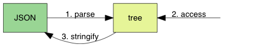

# `CppJson` 第一章节：自动测试，`NULL` 和 `bool` 值解析

## JSON 是什么

JSON（JavaScript Object Notation）是一个用于数据交换的文本格式，现时的标准为[ECMA-404](https://www.ecma-international.org/publications/files/ECMA-ST/ECMA-404.pdf)。

虽然 JSON 源至于 JavaScript 语言，但它只是一种数据格式，可用于任何编程语言。现时具类似功能的格式有 XML、YAML，当中以 JSON 的语法最为简单。

例如，一个动态网页想从服务器获得数据时，服务器从数据库查找数据，然后把数据转换成 JSON 文本格式：

```js
{
    "title": "Design Patterns",
    "subtitle": "Elements of Reusable Object-Oriented Software",
    "author": [
        "Erich Gamma",
        "Richard Helm",
        "Ralph Johnson",
        "John Vlissides"
    ],
    "year": 2009,
    "weight": 1.8,
    "hardcover": true,
    "publisher": {
        "Company": "Pearson Education",
        "Country": "India"
    },
    "website": null
}
```

网页的脚本代码就可以把此 JSON 文本解析为内部的数据结构去使用。

从此例子可看出，JSON 是树状结构，而 JSON 只包含 6 种数据类型：

- null: 表示为 null
- boolean: 表示为 true 或 false
- number: 一般的浮点数表示方式，在下一单元详细说明
- string: 表示为 "..."
- array: 表示为 [ ... ]
- object: 表示为 { ... }

我们要实现的 JSON 库，主要是完成 3 个需求：

1. 把 JSON 文本解析为一个树状数据结构（parse）。
2. 提供接口访问该数据结构（access）。
3. 把数据结构转换成 JSON 文本（stringify）。



我们会逐步实现这些需求。在本章节中，我们只实现最简单的 null 和 boolean 解析。

## 搭建编译环境

我们要做的库是跨平台、跨编译器的，同学可使用任意平台进行练习。

我们的 JSON 库名为 CppJson，代码文件只有 3 个：

1. `include/cppjson.hpp`：CppJson 的头文件（header file），含有对外的类型和 API 函数声明。
2. `cppjson.cpp`：CppJson 的实现文件（implementation file），含有内部的类型声明和函数实现。此文件会编译成库。
3. `cppjsonTest.cpp`：我们使用测试驱动开发（test driven development, TDD）。此文件包含测试程序，需要链接 CppJson 库。

为了方便跨平台开发，我们会使用一个现时最流行的软件配置工具 [CMake](https://cmake.org/)。

在 OS X 平台中，在命令行通过命令：

```shell
mkdir build
cd build
cmake -DCMAKE_BUILD_TYPE=Debug ..
make
```

将 Debug 改成 Release 就会生成 Release 配置的 makefile。

在 Vscode 中，可以通过配置 `tasks.json` 文件来进行自动 build：

```json
//.vscode/tasks.json
{
    "version": "2.0.0",
    "tasks": [
        {
            "type": "shell",
            "label": "mkdirbuild",
            "command": "mkdir",
            "options": {
                "cwd": "${fileDirname}"
            },
            "args": ["-p", "build"]
        },
        {
            "type": "shell",
            "label": "cmake",
            "command": "cmake",
            "args": [
                "-DCMAKE_BUILD_TYPE=Debug",
                //在此处添加其它CMAKE选项
                ".."
            ],
            "options": {
                "cwd": "${fileDirname}/build"
            },
        },
        {
            "label": "make",
            "command": "make",
            "args": ["-j16",], //根据机器cpu核心数量自行调整
            "options": {
                "cwd": "${fileDirname}/build"
            },
        },
        {
            "label": "build",
            "dependsOrder": "sequence",
            "dependsOn": ["mkdirbuild", "cmake", "make"],
        },
    ],
}
```

然后执行 build 生成的文件：

```shell
$ ./build/cppjson_test_ch01

16/16 (100.00%) passed
```

若看到类似以上的结果，说明已成功搭建编译环境，我们可以去看看那几个代码文件的内容了。

## 头文件与 API 设计


`Cpp` 语言有头文件的概念，需要使用 `#include`去引入头文件中的类型声明和函数声明。但由于头文件也可以 `#include` 其他头文件，为避免重复声明，通常会利用宏加入 include 防范（include guard）：

```cpp
#pragma once
```

如前所述，JSON 中有 6 种数据类型，如果把 true 和 false 当作两个类型就是 7 种，我们为此声明一个枚举类（enumeration calss）：

```cpp
enum class cppjsonType {
    CPPJSON_NULL,
    CPPJSON_TRUE,
    CPPJSON_FALSE,
    CPPJSON_NUMBER,
    CPPJSON_STRING,
    CPPJSON_ARRAY,
    CPPJSON_OBJECT
};
```

接下来，我们声明 JSON 的数据结构。JSON 是一个树形结构，我们最终需要实现一个树的数据结构，每个节点使用 `cppjson_value` 结构体表示，我们会称它为一个 JSON 值（JSON value）。

在此单元中，我们只需要实现 `null`, `true` 和 `false` 的解析，因此该结构体只需要存储一个  `cppjsonType`，之后的单元会逐步加入其他数据。

```cpp
typedef struct {
    cppjsonType type;
} cppjson_value;
```

然后，我们现在只需要两个 API 函数，一个是解析 JSON：

```cpp
cppjsonParseCode cppjson_parse(cppjson_value* v, const std::string json);
```

传入的 JSON 文本是一个 `string` 字符串，由于我们不应该改动这个输入字符串，所以使用 `const std::string` 类型。

返回值是以下这些枚举类中的值，无错误会返回 `cppjsonParseCode::OK`，其他值在下节解释。

```cpp
enum class cppjsonParseCode {
    OK,
    EXPECT_VALUE,
    INVALID_VALUE,
    ROOT_NOT_SINGULAR
};
```

现时我们只需要一个访问结果的函数，就是获取其类型：

```cpp
cppjsonType cppjson_get_type(const cppjson_value* v);
```

## JSON 语法子集

下面是此单元的 JSON 语法子集，使用 [RFC7159](https://tools.ietf.org/html/rfc7159) 中的 [ABNF](https://tools.ietf.org/html/rfc5234) 表示：

```json
JSON-text = ws value ws
ws = *(%x20 / %x09 / %x0A / %x0D)
value = null / false / true 
null  = "null"
false = "false"
true  = "true"
```

当中 `%xhh` 表示以 16 进制表示的字符，`/` 是多选一，`*` 是零或多个，`()` 用于分组。

那么第一行的意思是，JSON 文本由 3 部分组成，首先是空白（whitespace），接着是一个值，最后是空白。

第二行告诉我们，所谓空白，是由零或多个空格符（space U+0020）、制表符（tab U+0009）、换行符（LF U+000A）、回车符（CR U+000D）所组成。

第三行是说，我们现时的值只可以是 `null`、`false` 或 `true`，它们分别有对应的字面值（literal）。

我们的解析器应能判断输入是否一个合法的 JSON。如果输入的 JSON 不合符这个语法，我们要产生对应的错误码，方便使用者追查问题。

在这个 JSON 语法子集下，我们定义 3 种错误码：

- 若一个 JSON 只含有空白，传回 `LEPT_PARSE_EXPECT_VALUE`。
- 若一个值之后，在空白之后还有其他字符，传回 `LEPT_PARSE_ROOT_NOT_SINGULAR`。
- 若值不是那三种字面值，传回 `LEPT_PARSE_INVALID_VALUE`。

## 单元测试

许多同学在做练习题时，都是以 `printf`／`cout` 打印结果，再用肉眼对比结果是否乎合预期。但当软件项目越来越复杂，这个做法会越来越低效。一般我们会采用自动的测试方式，例如单元测试（unit testing）。单元测试也能确保其他人修改代码后，原来的功能维持正确（这称为回归测试／regression testing）。

常用的单元测试框架有 xUnit 系列，如 C++ 的 [Google Test](https://github.com/google/googletest)、C# 的 [NUnit](https://www.nunit.org/)。我们为了简单起见，会编写一个极简单的单元测试方式。

一般来说，软件开发是以周期进行的。例如，加入一个功能，再写关于该功能的单元测试。但也有另一种软件开发方法论，称为测试驱动开发（test-driven development, TDD），它的主要循环步骤是：

1. 加入一个测试。
2. 运行所有测试，新的测试应该会失败。
3. 编写实现代码。
4. 运行所有测试，若有测试失败回到3。
5. 重构代码。
6. 回到 1。

TDD 是先写测试，再实现功能。好处是实现只会刚好满足测试，而不会写了一些不需要的代码，或是没有被测试的代码。

但无论我们是采用 TDD，或是先实现后测试，都应尽量加入足够覆盖率的单元测试。

回到 CppJson 项目，`cppjsonTest.cpp` 包含了一个极简的单元测试框架：

```cpp
#include "include/cppjson.hpp"
#include <cstdio>
#include <stdio.h>
#include <typeinfo>

static int main_ret = 0;
static int test_count = 0;
static int test_pass = 0;

// 测试宏接口
// flag 表示测试点是否通过，如果未通过则打印异常信息
#define EXPECT_BASE(flag, expect, actual) \
    do {\
        test_count ++;\
        if (flag) test_pass ++;\
        else {\
            fprintf(stderr, "%s:%d, expect = %s(%d), actual = %s(%d)\n", __FILE__, __LINE__, typeid(expect).name(), static_cast<int>(expect), typeid(actual).name(), static_cast<int>(actual));\
            main_ret = 1;\
        }\
    } while(0)

#define EXPECT_TYPE(expect, actual) EXPECT_BASE((expect) == (actual), expect, actual)


//
static void test_parse_null() {
    cppjson_value v;
    v.type = cppjsonType::CPPJSON_FALSE;

    EXPECT_TYPE(cppjsonParseCode::OK, cppjson_parse(&v, "null"));
    EXPECT_TYPE(cppjsonType::CPPJSON_NULL, cppjson_get_type(&v));
}

static void test_parse() {
    test_parse_null();
    // ...
}

int main() {
    test_parse();
    printf("%d/%d (%3.2f%%) passed\n", test_pass, test_count, test_pass * 100.0 / test_count);
    return main_ret;
}
```

现时只提供了一个 `EXPECT_TYPE(expect, actual)` 的宏，每次使用这个宏时，如果 expect != actual（预期值不等于实际值），便会输出错误信息。

若按照 TDD 的步骤，我们先写一个测试，如上面的 `test_parse_null()`，而 `cppjson_parse()` 只返回 `cppjsonParseCode::OK`：

```shell
/CppJson/ch01/cppjsonTest.cpp:30, expect = 16cppjsonParseCode(0), actual = 16cppjsonParseCode(2)
15/16 (93.75%) passed
```

为通过的测试是因为 `cppjson_parse()` 没有把 `v.type` 改成 `cppjsonType::CPPJSON_NULL`，造成失败。我们再实现 `lept_parse()` 令到它能通过测试。

然而，完全按照 TDD 的步骤来开发，是会减慢开发进程。所以我个人会在这两种极端的工作方式取平衡。通常会在设计 API 后，先写部分测试代码，再写满足那些测试的实现。

## 实现解析器


有了 API 的设计、单元测试，终于要实现解析器了。

首先为了减少解析函数之间传递多个参数，我们把这些数据都放进一个 `cppjson_context` 结构体：

```cpp
typedef struct {
    std::string json;
} cppjson_context;

// json 解析函数：ws1 value ws2
cppjsonParseCode cppjson_parse(cppjson_value *v, const std::string json) {
    cppjson_context s; s.json = json;
    assert(v != NULL); v->type = cppjsonType::CPPJSON_NULL;

    // 分别解析 ws1 value ws2
    cppjson_parse_whitespace(&s);
    auto ret = cppjson_parse_value(&s, v);
    return ret == cppjsonParseCode::OK ? cppjson_parse_root_not_singular(&s) : ret;
}
```

CppJson 是一个手写的递归下降解析器（recursive descent parser）。由于 JSON 语法特别简单，我们不需要写分词器（tokenizer），只需检测下一个字符，便可以知道它是哪种类型的值，然后调用相关的分析函数。对于完整的 JSON 语法，跳过空白后，只需检测当前字符：

- n ➔ null
- t ➔ true
- f ➔ false
- " ➔ string
- 0-9/- ➔ number
- [ ➔ array
- { ➔ object

所以，我们可以按照 JSON 语法一节的 EBNF 简单翻译成解析函数：

```cpp
// 删除空白符
static void cppjson_parse_whitespace(cppjson_context* s) {
    const std::string str = s->json;

    int i = 0;
    while (str[i] == ' ' or str[i] == '\t' or str[i] == '\n' or str[i] == '\r') { i ++; }

    s->json = str.substr(i, str.size());
}

// 解析 ws2 之后是否还有非空值
static cppjsonParseCode cppjson_parse_root_not_singular(cppjson_context* s) {
    // 删除空白符
    cppjson_parse_whitespace(s);

    // 判断是否还有非空值
    if (s->json[0] != '\0') return cppjsonParseCode::ROOT_NOT_SINGULAR;
    else return cppjsonParseCode::OK;
}

// 检测 null 值
static cppjsonParseCode cppjson_parse_null(cppjson_context* s, cppjson_value* v) {
    const std::string str = s->json;

    auto head = str.substr(0, 4);
    if (head != "null") return cppjsonParseCode::INVALID_VALUE;
    else {
        s->json = str.substr(4, str.size());
        v->type = cppjsonType::CPPJSON_NULL;
        return cppjsonParseCode::OK;
    }
}

// 解析 value
static cppjsonParseCode cppjson_parse_value(cppjson_context* s, cppjson_value* v) {
    const std::string str = s->json;

    switch (str[0]) {
        case 'n': return cppjson_parse_null(s, v);
        case 't': return cppjson_parse_true(s, v);
        case 'f': return cppjson_parse_false(s, v);
        case '\0': return cppjsonParseCode::EXPECT_VALUE;
        default: return cppjsonParseCode::INVALID_VALUE;
    }
}
```