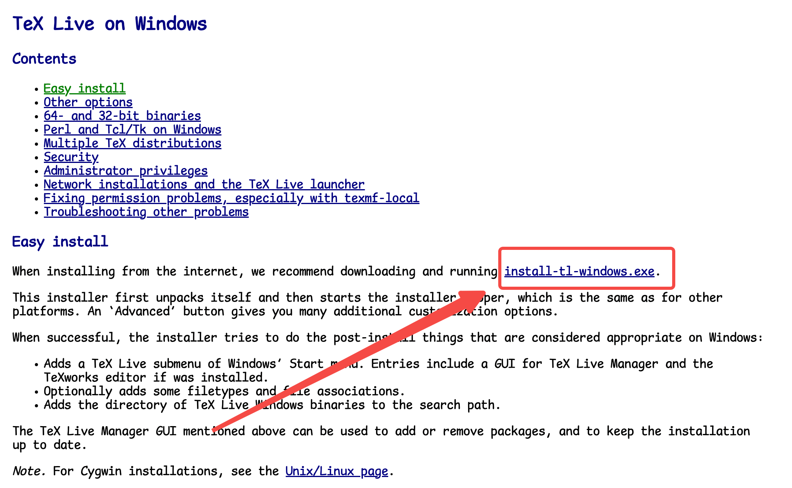
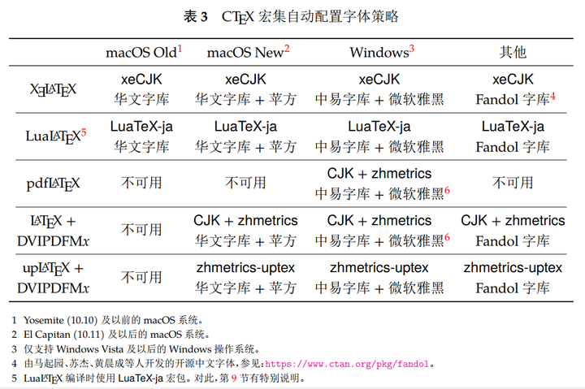
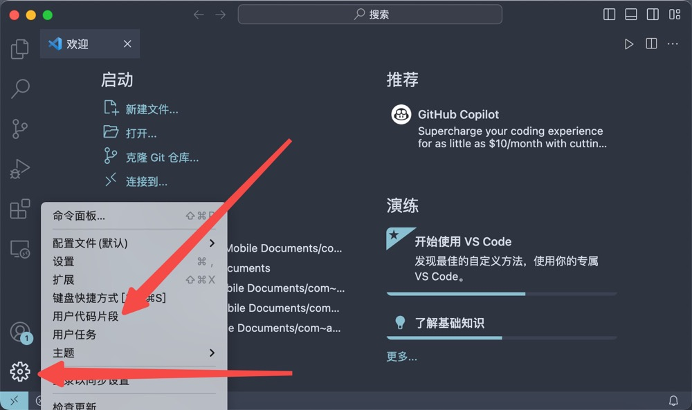

# 使用 $\LaTeX$ 优雅地完成创作

$\LaTeX$ 是一个文档准备系统 (Document Preparing System)，它非常适用于生成高印刷质量的科技类和数学类文档。它也能够生成所有其他种类的文档，小到简单的信件，大到完整的书籍。 $\LaTeX$ 使用 $\TeX$ 作为它的排版引擎，学习 $\LaTeX$ 是一个漫长而痛苦的过程，我们应该充分利用已知的资料，来尽量完成我们的需求。

## 从安装 $\TeX$ 引擎开始

$\TeX$ 引擎类似于 `gcc/g++` 或 `Python`，用于编译 $\LaTeX$ 文档。

不同平台中 $\TeX$ 的安装方法不尽相同，本文提供：`Windows11`、`Linux(Ubuntu 22.04)`、`MacOs(12.7)`、`Windows11-wsl2(Ubuntu22.04)`的安装方法。

如果你只是想简单体验 $\LaTeX$，可以使用 [overleaf](https://www.overleaf.com/) 在线编译平台。但出于环境稳定性和数据的安全性等因素，并不建议将其作为主力平台。

### Windows11

进入网站[tug.org for windows](https://tug.org/texlive/windows.html#install)，点击`install-tl-windows.exe`下载 $\TeX$ 安装器，然后运行安装即可。

<div style="display: flex; justify-content: center;">

</div>

不过，这种方法需要一直联网安装，网速不好的环境可以直接下载`iso`镜像进行本地安装。本文给出清华源镜像地址：[mirrors.tuna](https://mirrors.tuna.tsinghua.edu.cn/CTAN/systems/texlive/Images/)，下载后缀为`.iso`的文件（只用下载一个）。

下载完成后双击文件挂载镜像，然后打开镜像文件夹，右键点击`install-tl-windows.bat`文件，使用管理员打开，然后按照指引安装即可。

最新版本的安装器会自动添加环境变量，安装完成后打开`cmd`然后输入：

```shell
tex --version
```

若能输出 $\TeX$ 版本信息则安装成功：

```shell
TeX 3.141592653 (TeX Live 2023/W32TeX)
kpathsea version 6.3.5
Copyright 2023 D.E. Knuth.
```

### Linux(Ubuntu22.04)

打开终端，然后执行安装命令：

```shell
sudo apt update
sudo apt upgrade
sudo apt install texlive-full
```

等待安装完成即可，安装完成后执行命令：

```shell
tex --version
```

若能输出 $\TeX$ 版本信息则安装成功：

```shell
TeX 3.141592653 (TeX Live 2023/Debian)
kpathsea version 6.3.5
Copyright 2023 D.E. Knuth.
```

### MacOs(12.7)

打开终端，然后执行安装命令（推荐安装无窗体版本）：

```shell
brew install mactex-no-gui
```

等待安装完成即可，安装完成后执行命令：

```shell
tex --version
```

若能输出 $\TeX$ 版本信息则安装成功：

```shell
TeX 3.141592653 (TeX Live 2023)
kpathsea version 6.3.5
Copyright 2023 D.E. Knuth.
```

### Windows11-wsl2(Ubuntu22.04)

在`wsl2`中安装方式与在`Linux`中一样。

## 找到属于你的编辑器

市面上有很多 $\LaTeX$ 编辑器，且与使用的系统有关，下面是一些主观评价：

- 全平台通用：
    - `Vs Code`：作为地表最强编辑器，`Vs Code`拥有非常丰富的 $\LaTeX$ 插件和完备的配置方案，并且可以免费使用，但缺点是配置较为繁琐。
    - `Jetbrains`: 与`Vs Code`相对应的是`Jetbrains`系列， 其虽然也有 $\LaTeX$ 插件，但使用体验非常不好，且其文件管理方式并不适合每个人。
    - `Neovim`：如果说`Vs Code`是编辑器中的王后，那么`nvim`就是国王。`nvim`可以实现最大程度的自定义编辑方案，拥有海量插件生态，但缺点是学习路线非常陡峭，常人难以驾驭。
    - `sublime text`：`nvim`固然强大，但其难以上手的特点使得很多人对其望而却步。`sublime`打破了这个束缚，其界面优雅程度不亚于`nvim`，也具有丰富的插件来实现你的理想配置，但配置同样较为繁琐，且需要付费。
    - `TexStudio`：`texlive`默认自带编辑器，简单好用容易上手，是很多教程的主推编辑器，但笔者认为界面过于丑陋，不建议用。
- `Windows`独占：
    - `Winedt 11`：如果不考虑跨平台，那么`Winedt 11`就是`Windows`上的最佳编辑器。这是一款罕见的非所见即所得的编辑器，笔者认为这完美契合了 $\LaTeX$ 的风格，同时其优雅成熟的界面和高度可定制化的功能使其一骑绝尘。但需要付费（169元买断）。

综上所述，笔者最推荐`Vs Code`，但如果你只有`Windows`平台的使用需求并不介意一点费用的话，请果断购买`Winedt 11`。同样的，`MacOs`也拥有独占编辑器，但笔者没用过，在此不做评价。

关于这些编辑器如何配置，网上的教程有很多，读者可自行查阅。

## 一本教程入门 $\LaTeX$ 语法

对于所有初学者来说，[Ishort-zh-cn](https://mirror-hk.koddos.net/CTAN/info/lshort/chinese/lshort-zh-cn.pdf)都是最好的入门教程。在开始你的创作之前，请务必先行完整阅读一遍，并动手尝试书中的案例。

如果你已经完成了所有的案例，相信你已经对 $\LaTeX$ 语法有了简单了解，下面笔者给出一些新手可能遇到的常见问题。但请不要灰心，$\LaTeX$ 的学习是一件持久且困难的事，我们并不需要完全精通，只需要能够达到创作目的即可。

### 打印中文

$\LaTeX$ 默认只打印英文，如果没有合理的设置，`.tex`文件中的中文将无法正确打印。

从下图可以看出，目前支持全平台通用的方案只有`XeLaTeX`和`LuaTeX`。因此，主流方案是一般使用`xelatex+ctex`编译方案，底层调用`xeCJK`字符集来实现中文打印。

<div style='display: flex; justify-content: center;'>

</div>

使用时只需在导言区加入，编译器会使用默认字体进行编译：

```tex
\usepackage[UTF8]{ctex}
\usepackage{fontspec} % 设置字体
```

如果要指定字体，则需分别设置`font-family`：

```tex
\usepackage[UTF8, fontset=none]{ctex}  % 清除默认字体
\usepackage{fontspec}  % 设置字体
\setCJKmainfont{SimSun}[AutoFakeBold=true, BoldFont={SimHei}, ItalicFont={KaiTi}]  % 正文字体（宋体，黑体，楷体）
\setCJKsansfont[AutoFakeBold=3]{KaiTi} % 无衬线字体
\setCJKmonofont[AutoFakeBold=3]{SimHei} % 等宽字体
```

同样的，英文也可以自定义字体：

```tex
\setmainfont{Times New Roman} % 设置英文字体为新罗马体
```

> 详细配置可以参考：[LaTex 中文字体配置指南](https://zhuanlan.zhihu.com/p/538459335)

### 打印数学公式

你是否好奇过数学教材或者论文中复杂的数学公式是如何编写的？答案就是 $\LaTeX$，这也是 $\LaTeX$ 为什么被奉为珍宝的原因之一。

但是笔者并不建议读者专门花时间来学习如何编写 $\LaTeX$ 数学公式，而是利用现成的工具来快速完成你的公式。

- 在线数学公式生成平台：[latexlive](https://www.latexlive.com/)可以在线点击生成你所需要的数学公式，但前提是你已经了解了一些复杂数学环境。
- `MathType`：如果你是`Windows`用户，那么强烈建议使用`MathType`来生成数学公式的 $\LaTeX$ 代码，好处是完全不需要代码基础并且功能十分强大，但是需要付费。
- `mathpix`：这是一款专为 $\LaTeX$ 打造的数学公式 OCR 识别器，你可以截屏、拍照、甚至手写数学公式来得到你想要的代码。

### 绘制表格

你一定使用过`Excel`来绘制表格，但是在 $\LaTeX$ 中绘制表格并不是一件轻松的事情，其中有非常多的坑且几乎每个人都无法避免。

但不用担心，本文为你介绍开源项目 [excel2latex](https://www.ctan.org/pkg/excel2latex)。这是一款`Excel`插件，可以将你在`Excel`中绘制的表格自动转译为 $\LaTeX$ 代码。

但是这个插件并不是万能的，比如绘制三线表，即使是在`Excel`中也较为繁琐。因此，最好的处理方式是使用`excel2latex`插件生成表格主体，然后再自己添加分隔格式。

### 插入图片

绘制表格和插入图片并称为 $\LaTeX$ 中两大天坑，对于图片插入笔者尚未发现有效替代工具，在下文中会给出一些示例代码供读者参考。

## 学会使用代码片段

阅读到这里，相信你已经能够使用 $\LaTeX$ 创作出你自己的内容了。那么你应该不难发现，在创作的时候有很多代码都是可以重复使用的，只需要更改一些参数即可。但是 $\LaTeX$ 并不能像编程语言那样编写函数来实现代码的复用，当然有其他方法来实现（比如编写`.sty`和`.cls`文件），但这对初学者来说太难了。

因此，有没有一种好的方法可以实现这个需求呢？答案是代码片段（code snippets）。

代码片段可以给你的编辑器添加些许魔力。它如同咒语一般。你只要说出指令（输入前缀），挥动魔杖（按下 Enter 或者 Tab 键），然后神奇的事情就发生在你眼前了。

### Vs Code配置代码片段

点击左下角的设置按钮，然后点击设置用户代码片段：

<div style='display: flex; justify-content: center;'>

</div>

在弹出的窗口中输入`latex`然后选中即可跳转到`latex.json`文件，我们可以在这里设置我们的代码片段。

比如这段设置，保存文件后我们只需要在`.tex`后缀的文件中输入`insertImg`然后回车就会自动填充以下代码，并且使用`tab`来依次输入参数。

```json
"insertImg": {
    "prefix": "insertImg",  // 代码片段别名
    "body": [  // 代码片段主体
        "\\begin{figure}[H]",
        "    \\centering",
        "    \\includegraphics[width=0.8\\textwidth]{$1}",  // 参数1：图片路径
        "    \\caption{$2}",  // 参数2：图片标题
        "    \\label{$3}",  // 参数3：图片索引
        "\\end{figure}$0",
    ],
    "description": "insert one img with 0.8 width"
},
```

### Winedt 设置代码片段

依次点击`Option -> Options Interface -> Menus and Toolbar -> Main Menu`，修改或添加配置：

```ini
ITEM="Figure"
  CAPTION="&Figure"
  IMAGE="Figure"
  MACRO="Exe('%b\Menus\Insert\Image.edt');"
  SHORTCUT="49222::Ctrl+Alt+F"
  REQ_DOCUMENT=1  
```

然后就可以使用快捷键`Ctrl+Alt+F`填充插入图片的代码片段。

## 使用模板来专注内容

使用 $\LaTeX$ 来完成创作时，不同的需求的格式要求通常也不同。一般而言，格式的设置复杂且繁琐，如果将大部分时间花在调整格式上面有违 $\LaTeX$ 的初衷。

因此，常见期刊都会提供对应的 $\LaTeX$ 风格模板和示例，其中主要文件通常为：

- `.sty`：$\LaTeX$ 样式文件，包含一组宏包和命令，用于定制文档的样式、格式和功能。通常包括：宏包的引入、自定义命令、颜色与字体预设等。
- `.cls`：$\LaTeX$ 文档文件，定义文档的整体结构和布局。通常包括：导言区设置、章节标题样式、页眉页脚与文档尺寸预设等。
- `.tex`：示例文件，通常会包括论文中会用到的所有样式的示例代码。

阅读示例文件可以让我们快速创作出符合格式要求的作品，让我们不再为格式烦恼，只用专注于内容本身。