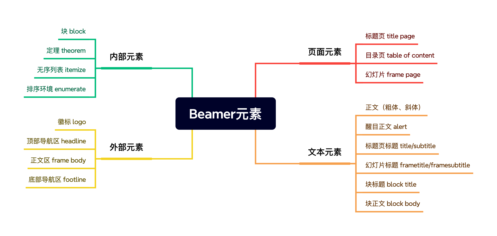

# 东华大学学术 Beamer 模板

本模板为东华大学专用的学术报告 Slides 的 LaTeX Beamer 模板使用说明，主要特点为：

- 设计元素全部来源于东华大学 [标识系统](https://www.dhu.edu.cn/bsxt/listm.htm)，浓浓的东华风。
- Slides 整体风格借鉴了东华大学标准 PPT 模板与学术 PPT 模板（2020版，[模板连接](https://www.dhu.edu.cn/_upload/article/files/d2/8c/2137ec0c44238fd6fbd3ee28ff07/9f9b566a-67f1-4717-991f-477ee5b43acb.zip)）。
- 简洁清晰的底部导航区让 Slides 更适合学术汇报使用。
- 前后端分离式设计，`.tex` 文件中只需聚焦内容，`.sty` 配置文件隔离存放。

## 使用 dhuBeamer 模板
### 认识 Beamer 中的元素

Beamer 根据元素在 Slides 中的不同作用，主要做了以下划分：

## 修改 dhuBeamer 模板