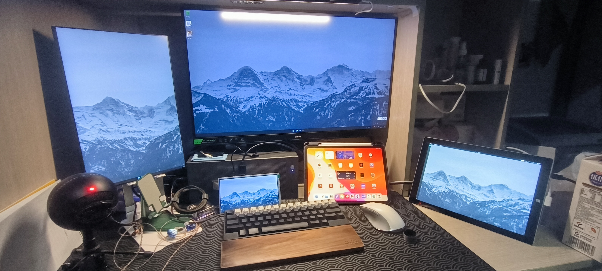
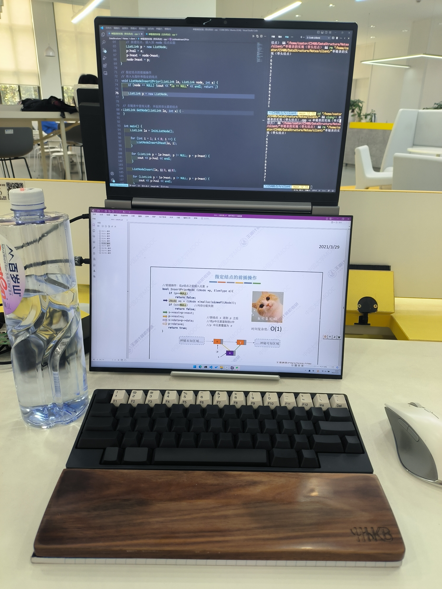
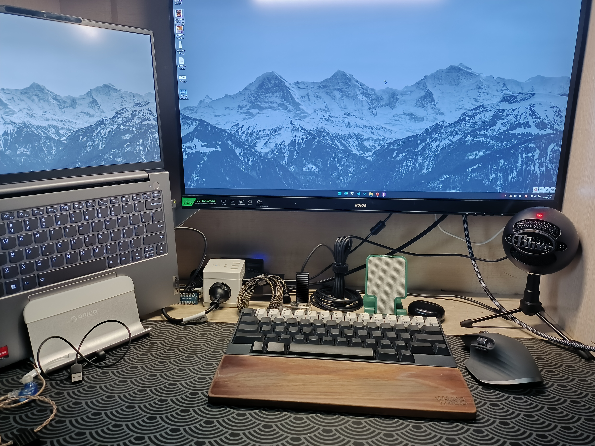
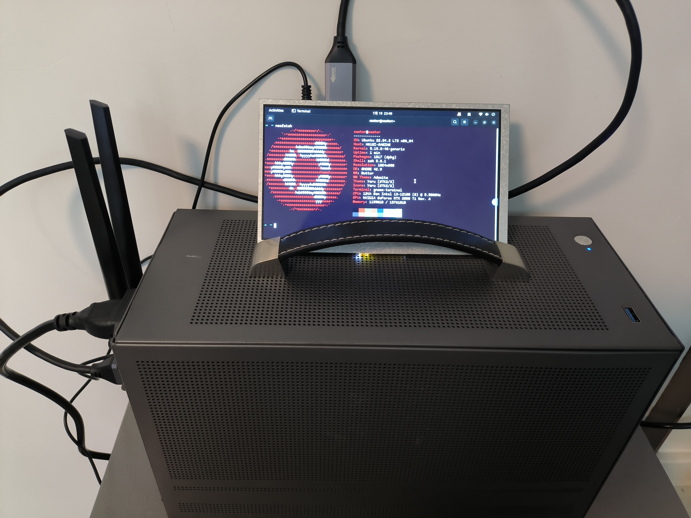
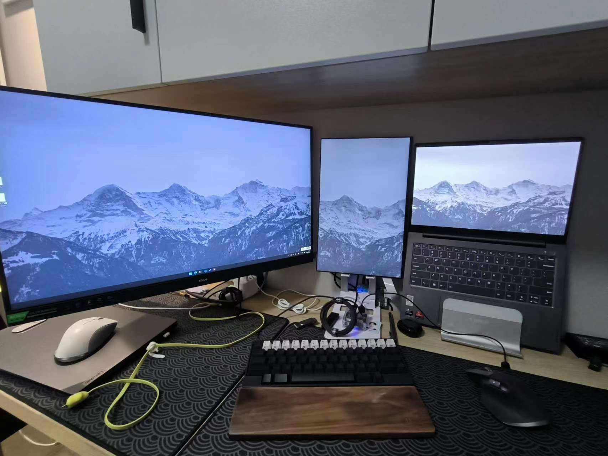
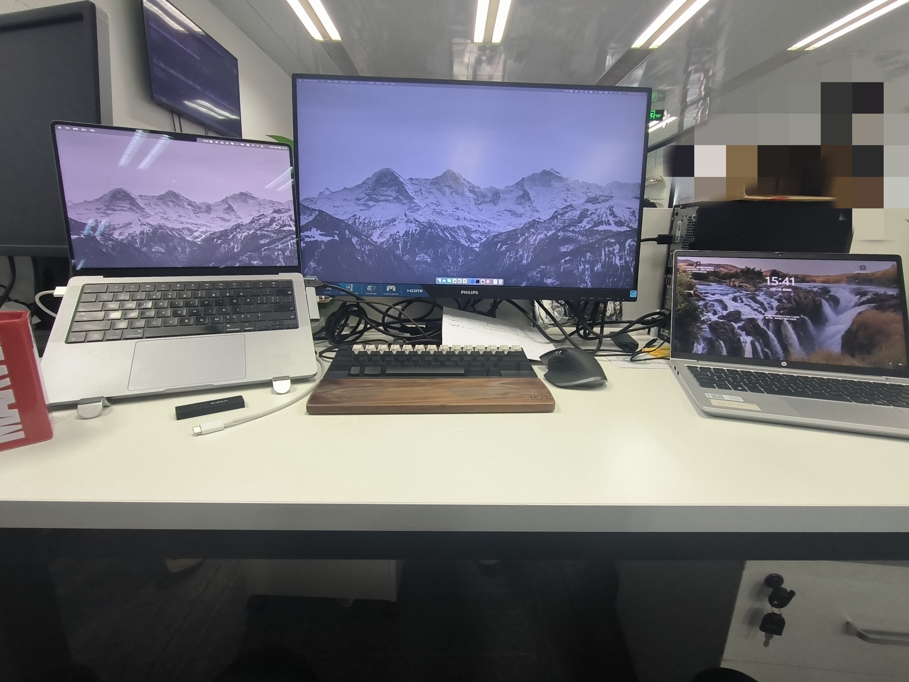
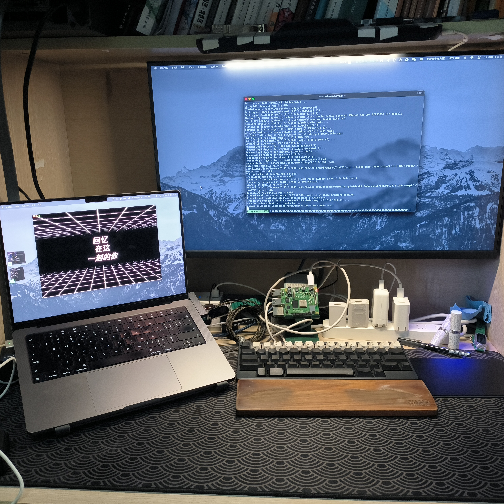

# 用桌面变化来总结 2023
## 3月16日，我有 5 块屏幕

这段时间是我同时使用屏幕数量最多的时候，主屏幕写代码，副屏幕看网页；surface 和工控屏做直播推流；iPad 负责预览直播画面：

- 主屏幕（中间）：27 寸 2k，副屏幕（最左）：15.6 寸 2k
- surface（最右），工控屏（最小）：7 寸 1080p
- iPad（非统一背景）

几乎每天都在宿舍，买了本《明解 C++》一边学语言一边学算法。虽然算法已经忘得差不多了，但坚实的 `C++` 基础对我帮助很大，甚至我现在实习的主要内容就是 `C++` 开发。

## 5月10日，我有 2 块屏幕

学完了 `C++` 语言基础后，我开始意识到数据结构对编程的重要性。同时也有为考研做准备的打算，我开始每天往返图书馆，刷王道考研的 CS408 课程。

为了方便往返图书馆并尽可能满足我多屏幕的需求，买了一台可以 180 度开合的笔记本（ThinkBook 14）和一个立式支架，搭配 ThinkPad 的 GaN 100W 充电器和雷电线，只需 2 根线完成所有的连接。这样的好处是可以上面写代码下面看课程，同时使用外接键盘不会很突兀。

## 6月18日，我有 2 块屏幕

春季学期结束后，我也放弃了考研的打算，开始往机器学习和 Pytorch 的方向学习。翻出以前买的西瓜书和南瓜书，对着 Github 上的开源笔记边看边学。由于宿舍桌子太窄了，放三块屏幕过于拥挤，于是将 15.6 寸的副屏收了起来。

趁着 618 换了罗技的 master 3s 鼠标，手感确实比雷蛇的 click Pro 好很多。同时每天都坚持录视频，之前买的麦克风也派上了用场。

## 7月19日，我有 1 块屏幕

随着 Pytorch 学习的深入，笔记本的核显已经无法满足需求。而此时矿潮已经开始逐渐褪去，随着 4090 的发布老显卡的价格开始走低，索性在咸鱼上淘了一张服务器版的 2080Ti：

- 300A 核心，三星显存
- 纯铜涡轮散热，尾部供电

其 11G 的显存足以满足入门需求，同时后期还可以加焊 22G 显存，是一张性能和成长空间都不错的显卡。

同时为了最大限度使用显卡，直接把机器刷成了 Ubuntu server，将之前的监控屏用来监控显卡状态。

## 7月20日，我有 3 块屏幕

搞深度学习，真的是屏幕越多越好，有太多的资料和数据集看不过来：

- 主显示器用来看资料
- 副显示器用来看数据集（竖直摆放）
- 笔记本屏幕用来写代码

## 9月6日，我有 1 块屏幕

秋季学期重回宿舍后，开始迷上了 Minecraft 和泡茶，一杯茶一个种子就是一天。这段时间是最放松的时间，每天都在搭方块。

## 10月19日，我有 3 块屏幕

开始实习后，第一次用上了 MacOS。但尴尬的是，工作用的编译和测试环境还是 Windows，所以基本上都是在 Mac 上面通过 SSH 远程 Windows 进行开发（VsCode 大法好）：

- 开发环境：MacBookPro（左边）和主屏幕：28 寸 4k
- 编译环境：dell Windows 主机（无屏幕）
- 测试环境：hp | ThinkPad（右边）

同时，我也负责服务器上的容器部署等相关工作，所以我有幸同时使用 3 大主流操作系统。

## 12月31日，我有 2 块屏幕

适应实习的节奏后，晚上回宿舍的几个小时是每天最舒服的，因为可以不用管公司的事情专注自己喜欢的项目。

趁着放假买了一块树莓派 4B 在宿舍折腾，初步搭了 Seafile 和 Gitlab。

