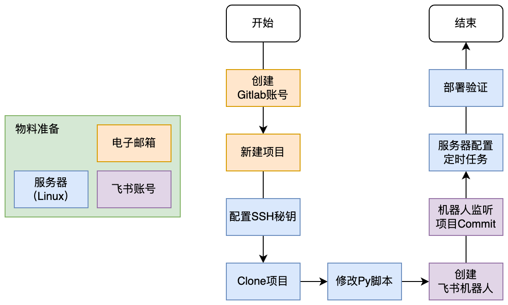
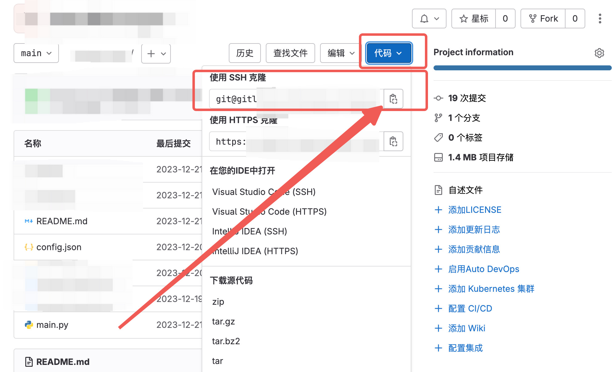
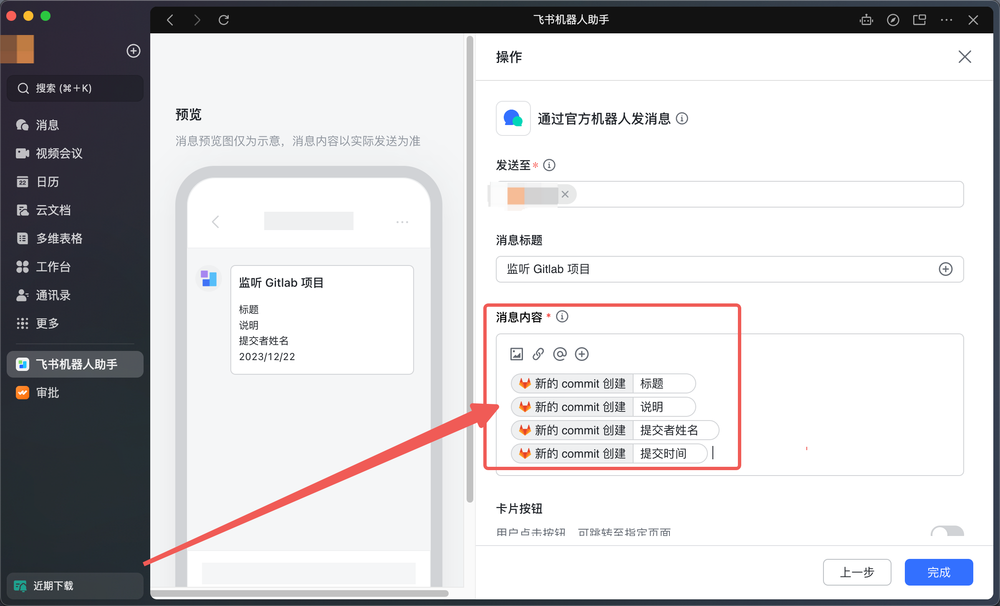

# 飞书机器人监听 Gitlab 项目

在服务器部署定时任务（爬虫、拉取数据库、模型训练等），任务完成后自动填写 commit 信息，并 `push` 到 Gitlab。

使用飞书机器人自动监听 Gitlab 项目，并获取 commit 信息，最终发送到飞书指定用户或群聊。

<div style='display: flex; justify-content: center;'>

</div>

## 准备工作

实现这个功能，你需要准备：

- 电子邮箱：用于创建 Gitlab 账号和绑定 SSH 秘钥。
- 飞书账号：用于创建机器人监听 Gitlab 项目。
- 服务器（Linux）：用于部署任务，并自动 `push` 到 Gitlab。

## 创建 Gitlab 账号并新建项目

使用准备好的邮箱，注册 Gitlab 账号：https://gitlab.com/

注册完成后新建一个新项目，并添加一个 `README.md` 文件。

## 配置 SSH 秘钥

使用 Terminal 连接你的服务器，使用以下命令（Ubuntu 22.04）：

```shell
sudo apt update && sudo apt upgrade
sudo apt install git
git config --global user.name "name"
git config --global user.email "email"
ssh-keygen -C "email" -t rsa
cat ~/.ssh/id_rsa.pub
```

其中 `name` 为 Gitlab 账号的名称，`email` 为 Gitlab 账号的邮箱，将输出的内容复制到剪切板。

然后在 Gitlab 中，进入用户设置，找到 SSH 秘钥然后选择添加新秘钥，粘贴剪切板的内容保存即可。

## Clone 项目并配置任务

在 Gitlab 中打开项目，点击右上角的代码，复制使用 SSH 克隆的链接：

<div style='display: flex; justify-content: center;'>

</div>

然后在 Terminal 中找到合适的位置，Clone 项目：

```shell
git clone git@gitlab.com:xxxxxxxxxxxxxxxxxx.git
```

编写你的任务脚本（`shell` 或 `Python` 等），然后确保其能正常运行。

## 新建飞书指令

使用飞书机器人助手，新建机器人指令，触发器选择 [新的 commit 创建]，按照教程绑定 Gitlab 账号和项目：

<div style='display: flex; justify-content: center;'>

</div>

然后选择操作 [通过官方机器人发消息]，设置消息内容为 commit 说明，并选择发送目标：

<div style='display: flex; justify-content: center;'>

</div>

<div style='display: flex; justify-content: center;'>

</div>

点击完成后，启用机器人即可。

## 创建定时任务

首先测试飞书机器人是否能够正常抓取 Gitlab 项目的 commit，测试成功后，在服务器上为任务创建定时任务。

本文推荐使用 `systemctl` 和 `systemd` 的 `timer` 来创建定时任务。

### 创建定时器配置

创建一个 `task.timer` 文件：

```ini
[Unit]
Description=Your Timer Description

[Timer]
# OnCalendar设置定时规则，这里是每天10点
OnCalendar=*-*-* 10:00:00

[Install]
WantedBy=timers.target
```

### 创建定时器服务

创建一个 `task.service` 文件（默认使用 root 用户，建议指定 `User` 用户）：

```ini
[Unit]
Description=Your Service Description

[Service]
Type=simple
User=user
# 建议使用 shell 脚本
ExecStart=/path/to/your/script.sh
```

### 添加定时任务

```shell
sudo cp your_timer_name.timer /etc/systemd/system/
sudo cp your_service_name.service /etc/systemd/system/

sudo systemctl daemon-reload

# 手动启用任务，测试任务是否正常运行
sudo systemctl start your_timer_name.service
# 输出任务运行日志
sudo journalctl -u your_timer_name.service
```

任务运行成功后，使用以下命令启用定时任务：

```shell
sudo systemctl enable your_timer_name.timer
sudo systemctl list-timers
```