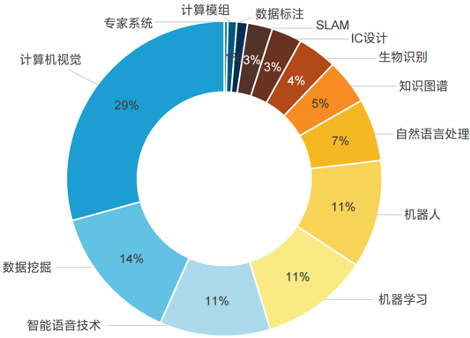
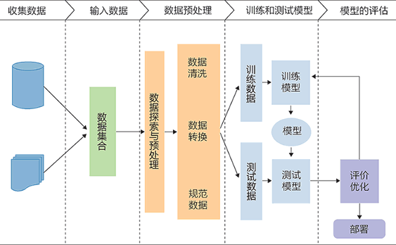
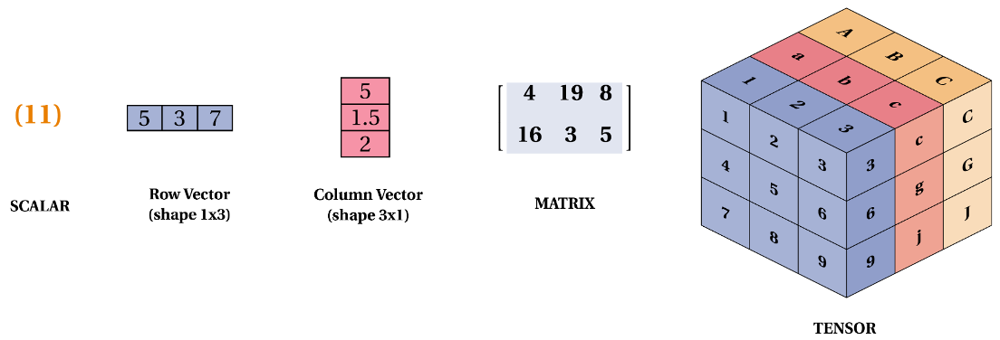
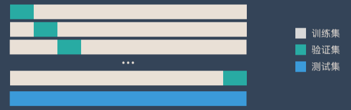
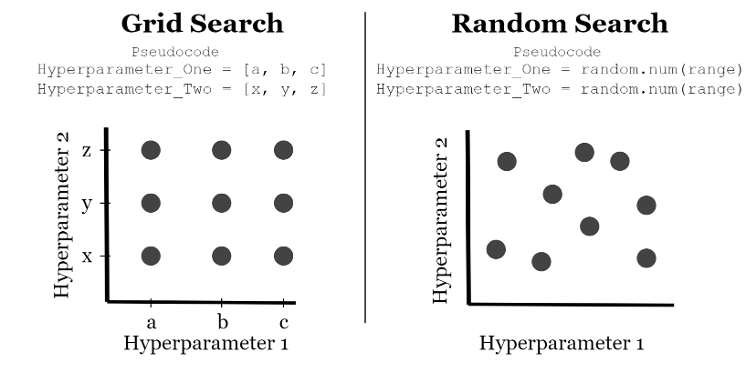

# 机器学习概述
## 什么是机器学习

机器学习是一种新的编程范式，机器学习系统是训练出来的，而不是明确用程序编写出来的。

机器学习的定义1：机器学习是这样的领域，它赋予计算机学习的能力，（这种学习能力）不是通过显著式编程获得的。

- 事先并不约束计算机必须总结出什么规律，让计算机自己挑选最有效的规律。
- 让计算机自己总结规律的编程方法，叫作 **非显著式编程**。
- 显著式编程：定死了程序的输入和输出，识别率不会随着训练样本增加而变化。

机器学习的定义2：一个计算机程序被称为可以学习，是指它能够针对某个任务 T 和某个性能指标 P，从经验 E 中学习。这种学习的特点是，它在 T 上的被 P 衡量的性能，会随着经验 E 的增加而提高。

例如，在菊花和玫瑰的识别中：

- 任务 T：编程计算机程序识别菊花和玫瑰
- 经验 E ：菊花和玫瑰的图片
- 性能指标 P：菊花和玫瑰的识别正确率

机器学习定位：

- 人工智能：机器展现的人类智能。
- 机器学习：计算机利用已有的数据（经验），得出了某种模型（规律），并利用此模型来预测未来的一种方法。
- 深度学习：实现机器学习的一种技术。

## 为什么要使用机器学习

第四次工业革命（第二次信息革命）：以大数据、人工智能、物联网等信息技术为基础的超连接革命。

机器学习的优点：

- 对于那些现有解决方案需要大量手动调整挥着是规则列表超长的问题：通过机器学习算法可以简化代码，并提升执行表现。
- 对于那些传统技术手段根本无法解决的复杂问题，如语音识别：通过机器学习技术可以找到一个解决方案。
- 对于环境波动：机器学习系统可以适应新的数据。
- 从复杂问题和海量数据中获得洞见。

例如：垃圾邮件过滤器、预测流行趋势、识别水军、预测未来房价、自动驾驶、自动改卷、电影推荐等。

## 机器学习系统的种类

1. 是否在人类监督下训练
    - 监督学习、无监督学习、半监督学习和强化学习
2. 是否可以动态地进行增量学习：
    - 在线学习、批量学习
3. 基于实例还是基于模型：
    - 基于实例的学习、基于模型的学习

### 维度1：是否在人类监督下训练

1. 有监督的学习：依赖于标记数据进行训练。其核心思想是利用已知的输入数据（特征）和输出数据（标签）来训练模型，使模型能够在遇到新数据时预测未知标签。
    - 回归（连续的数值）：给出一系列产品的价格，预测某产品的价格。
    - 分类（离散的类别）：给出一系列类别的图片，分辨某图片的类别。
2. 无监督的学习（未来）：在没有明确标注或目标变量的情况下，从数据中提取有用的信息或模式。
    - 聚类：将数据点分组，使得同一组中的数据点彼此相似，而不同组的数据点差异较大。
    - 降噪：保持数据主要特征的情况下减少数据的维度，主要用于数据可视化或去除噪声。
    - 关联规则：从数据集中找出变量之间的有趣关系或关联模式，最常见的例子是市场购物篮分析。
    - 异常检测：识别数据中不符合多数样本模式的异常点。
    - ChatGPT（文生文）、Stable Diffusion（文生图）、SORA（文生视频）。
3. 半监督学习：利用少量标记数据和大量未标记数据来进行模型训练。这种方法在标记数据难以获得或者昂贵的情况下非常有用，而未标记数据相对便宜和容易获取。
4. 强化学习：智能体（Agent）通过与环境（Environment）的交互学习如何采取行动（actions），以最大化其累积的长期奖励。通过试错的惩罚（Penalties）和奖励（Rewards）的反馈来进行学习。
    - 游戏 AI、推荐系统等。

### 维度2：是否可以动态地进行增量学习

1. 分类依据：看系统是否可以从传入的数据流中进行增量学习
2. 批量学习（离线学习）：
    - 系统无法进行增量学习。
    - 必须使用所有数据进行训练。
    - 对于新数据，需要将老数据 + 新数据合并后，一起重新训练一个新版本的系统，然后停用旧系统。
3. 增量学习（在线学习）：
    - 系统可以进行增量学习
    - 循序渐进地给系统提供训练数据，逐步积累学习成果。
    - 整个过程通常是离线完成的，（即不在 live 系统上），因此用增量学习更为适合。

### 维度3：基于实例还是基于模型

1. 基于实例的学习：
    - 死记硬背
    - 系统先完全记住学习示例，然后通过某种相似的度量方式将其泛化到新的实例。
2. 基于模型的学习：
    - 从一组示例集中学习出构建这些示例的模型，然后使用该模型进行预测。

## 机器学习的基本步骤

数据和特征决定了机器学习的上界，而模型和算法只是去逼近这个上界。

### 机器学习流程

1. 加载数据
2. 训练 / 测试集切分
3. 数据预处理
    - 标准化、归一化、二值化、编码分类特征、缺失值处理、生成多项式特征
4. 创建模型
    - 有监督学习评估器：线性回归、支持向量机、朴素贝叶斯、KNN
    - 无监督学习评估器：主成分分析、K-Means 聚类
5. 模型拟合
6. 预测
7. 评估模型性能
    - 分类评价指标：准确率、分类预估评价函数、混淆矩阵
    - 回归评价指标：平均绝对误差、均方误差、$R^2$ 误差
    - 聚类评价指标：调整兰德系数、同质性、V-measure
    - 交叉验证
8. 模型调整
    - 网格搜索超参优化
    - 随机搜索超参优化

### 步骤一：加载数据

机器学习的本质是学习一个数据 X 到数据 Y 的映射，其中数据有多种表示类型：

相关术语：以鸢尾花分类数据集为例
- 每行的记录（一朵鸢尾花的数据统计），称为一个【样本(sample)】。
- 反映样本在某方面的性质，例如萼片长度、花瓣长度等，称为【特征(feature)】。
- 特征的取值，例如花瓣长度（$1, 2, \cdots$），称为【特征值（feature value）】。
- 关于样本结果的信息，例如雄性、雌性，称为【类别标签(class label)】。
- 包含标签信息的示例，称为【样例(instance)】，即【样例 = （特征，标签）】。
- 从数据中学习模型的过程称为【学习(learning)】或【训练(training)】。
- 在训练数据中，每个样例称为【训练样例(training instance)】，整个集合称为【训练集(training set)】。

### 步骤二：训练集/验证集/测试集

训练集：上课学知识；验证集：课后练习题；测试集：期末考试。通常为 8:1:1 分布。

### 步骤三：数据预处理

- 标准化：将特征数据转换为均值为0、方差为1的分布，使数据符合标准正态分布，有助于模型对不同量级特征的处理。
- 归一化：将数据压缩到特定区间（通常是[0,1]），保持不同特征之间的相对关系，常用于需要绝对数值范围的模型（如神经网络）。
- 二值化：将数值型数据转换为0和1的二值形式，常用于将连续特征转化为离散类别。
- 编码分类特征：将分类数据（如文本类别）转换为数值数据，以便模型处理，常见方法有独热编码（One-Hot Encoding）和标签编码（Label Encoding）。
- 缺失值处理：针对数据集中缺失的部分进行填充或删除，常见方法有使用均值、众数、中位数填充或直接删除缺失值的样本。
- 生成多项式特征：通过特征之间的组合（如平方、交互项等）生成新的特征，以提升模型的非线性能力。

### 步骤四：创建模型

- 有监督学习评估器：线性回归、支持向量机、朴素贝叶斯、KNN
- 无监督学习评估器：主成分分析、K-Means 聚类

### 步骤五：模型拟合

通常表现为：`model.fit(x_tarin, y_train)`

### 步骤六：模型预测

通常表现为：`model.predict(x_test)`

### 步骤七：模型评估

- 分类评价指标：准确率、分类预估评价函数、混淆矩阵
- 回归评价指标：平均绝对误差、均方误差、$R^2$ 误差
- 聚类评价指标：调整兰德系数、同质性、V-measure
- 交叉验证

K 折交叉验证：一种【动态验证】的方式，可以降低数据划分带来的影响
- 将数据集分为训练集和测试集，将测试集放在一边。
- 将训练集分为 K 份，每次使用 K 份中的 1 份作为验证集，其他全部作为训练集。
- 通过 K 次训练后，就会得到 K 个不同的模型。
- 评估 K 个模型的效果，从中挑选效果最好的超参数。
- 使用最优的超参数，然后将 K 份数据全部作为训练集重新训练，得到最终模型。

### 步骤八：模型调整（调参）

- 网格搜索超参优化：通过穷举所有可能的超参数组合来寻找模型的最优参数。它会遍历预定义的超参数值网格，逐一训练模型并评估其性能，最终选择表现最佳的参数组合。
- 随机搜索超参优化：相比网格搜索，通过在预定义的超参数范围内随机选择一部分组合进行模型训练和评估，寻找最优参数。它减少了搜索空间，节省计算资源，但可能无法覆盖所有最佳参数组合。

