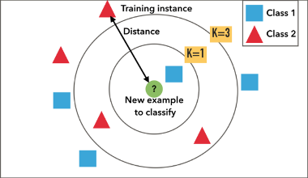
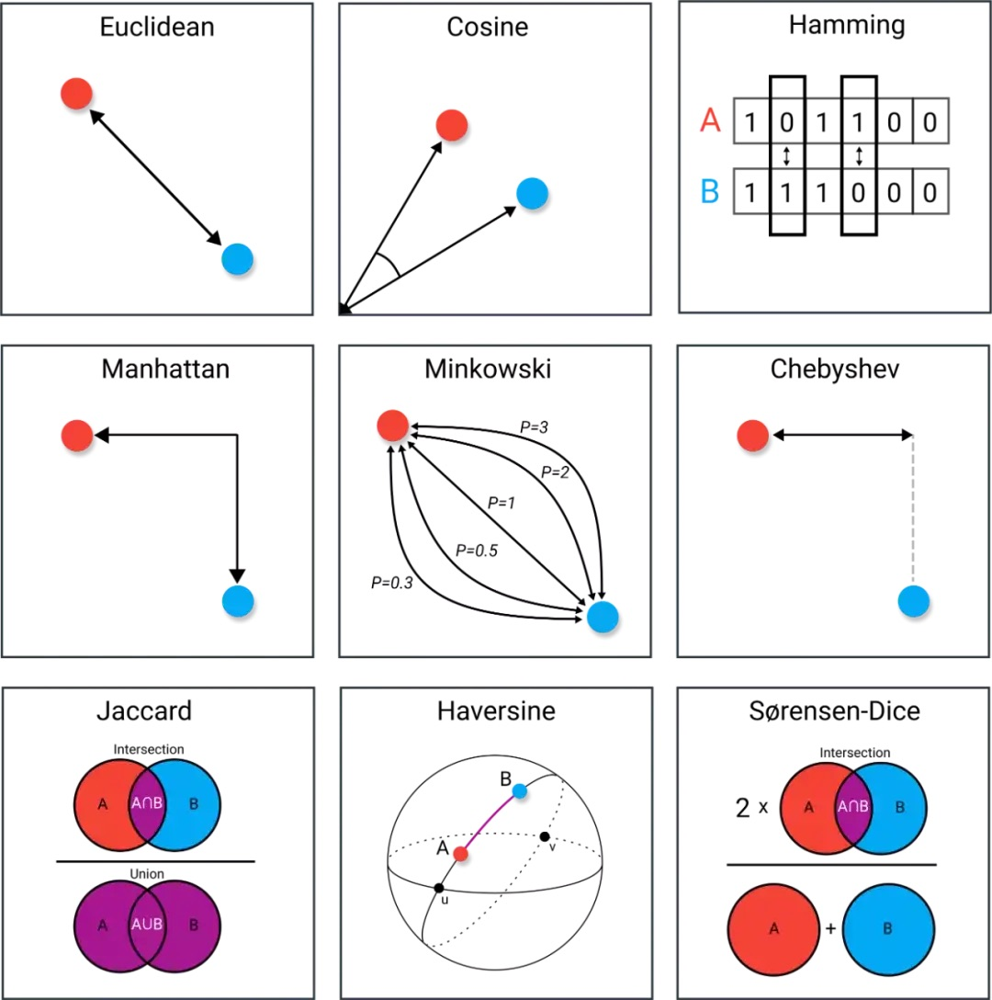
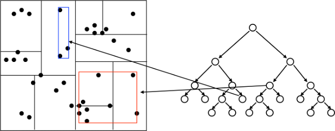

# K 近邻法

物以类聚，人以群分，K 近邻法的核心是邻居的数量和距离。

<div style='display: flex; justify-content: center;'>

</div>

## K 近邻算法

K 近邻（K-Nearest Neighbor, KNN）学习是一种常用的监督学习方法：
- 确定训练样本，以及某种【距离度量】。
- 对于某个给定的测试样本，找到训练集中距离最近的【K 个样本】。
- 对于【分类问题】使用【投票法】获得预测结果。
- 对于【回归问题】使用【平均法】获得预测结果。
- 还可基于距离远近进行加权平均或加权投票，距离越近的样本权重最大
    - 投票法：选择这 K 个样本中出现最多的类别标记作为预测结果。
    - 平局法：将这 K 个样本的实值输出标记的平均值作为预测结果。

输入：训练数据集

<div style='display: flex; justify-content: center;'>
<svg xmlns="http://www.w3.org/2000/svg" width="35.145ex" height="2.262ex" viewBox="0 -750 15534.3 1000" xmlns:xlink="http://www.w3.org/1999/xlink" aria-hidden="true" style=""><defs><path id="MJX-13-TEX-I-1D447" d="M40 437Q21 437 21 445Q21 450 37 501T71 602L88 651Q93 669 101 677H569H659Q691 677 697 676T704 667Q704 661 687 553T668 444Q668 437 649 437Q640 437 637 437T631 442L629 445Q629 451 635 490T641 551Q641 586 628 604T573 629Q568 630 515 631Q469 631 457 630T439 622Q438 621 368 343T298 60Q298 48 386 46Q418 46 427 45T436 36Q436 31 433 22Q429 4 424 1L422 0Q419 0 415 0Q410 0 363 1T228 2Q99 2 64 0H49Q43 6 43 9T45 27Q49 40 55 46H83H94Q174 46 189 55Q190 56 191 56Q196 59 201 76T241 233Q258 301 269 344Q339 619 339 625Q339 630 310 630H279Q212 630 191 624Q146 614 121 583T67 467Q60 445 57 441T43 437H40Z"></path><path id="MJX-13-TEX-N-3D" d="M56 347Q56 360 70 367H707Q722 359 722 347Q722 336 708 328L390 327H72Q56 332 56 347ZM56 153Q56 168 72 173H708Q722 163 722 153Q722 140 707 133H70Q56 140 56 153Z"></path><path id="MJX-13-TEX-N-7B" d="M434 -231Q434 -244 428 -250H410Q281 -250 230 -184Q225 -177 222 -172T217 -161T213 -148T211 -133T210 -111T209 -84T209 -47T209 0Q209 21 209 53Q208 142 204 153Q203 154 203 155Q189 191 153 211T82 231Q71 231 68 234T65 250T68 266T82 269Q116 269 152 289T203 345Q208 356 208 377T209 529V579Q209 634 215 656T244 698Q270 724 324 740Q361 748 377 749Q379 749 390 749T408 750H428Q434 744 434 732Q434 719 431 716Q429 713 415 713Q362 710 332 689T296 647Q291 634 291 499V417Q291 370 288 353T271 314Q240 271 184 255L170 250L184 245Q202 239 220 230T262 196T290 137Q291 131 291 1Q291 -134 296 -147Q306 -174 339 -192T415 -213Q429 -213 431 -216Q434 -219 434 -231Z"></path><path id="MJX-13-TEX-N-28" d="M94 250Q94 319 104 381T127 488T164 576T202 643T244 695T277 729T302 750H315H319Q333 750 333 741Q333 738 316 720T275 667T226 581T184 443T167 250T184 58T225 -81T274 -167T316 -220T333 -241Q333 -250 318 -250H315H302L274 -226Q180 -141 137 -14T94 250Z"></path><path id="MJX-13-TEX-I-1D465" d="M52 289Q59 331 106 386T222 442Q257 442 286 424T329 379Q371 442 430 442Q467 442 494 420T522 361Q522 332 508 314T481 292T458 288Q439 288 427 299T415 328Q415 374 465 391Q454 404 425 404Q412 404 406 402Q368 386 350 336Q290 115 290 78Q290 50 306 38T341 26Q378 26 414 59T463 140Q466 150 469 151T485 153H489Q504 153 504 145Q504 144 502 134Q486 77 440 33T333 -11Q263 -11 227 52Q186 -10 133 -10H127Q78 -10 57 16T35 71Q35 103 54 123T99 143Q142 143 142 101Q142 81 130 66T107 46T94 41L91 40Q91 39 97 36T113 29T132 26Q168 26 194 71Q203 87 217 139T245 247T261 313Q266 340 266 352Q266 380 251 392T217 404Q177 404 142 372T93 290Q91 281 88 280T72 278H58Q52 284 52 289Z"></path><path id="MJX-13-TEX-N-31" d="M213 578L200 573Q186 568 160 563T102 556H83V602H102Q149 604 189 617T245 641T273 663Q275 666 285 666Q294 666 302 660V361L303 61Q310 54 315 52T339 48T401 46H427V0H416Q395 3 257 3Q121 3 100 0H88V46H114Q136 46 152 46T177 47T193 50T201 52T207 57T213 61V578Z"></path><path id="MJX-13-TEX-N-2C" d="M78 35T78 60T94 103T137 121Q165 121 187 96T210 8Q210 -27 201 -60T180 -117T154 -158T130 -185T117 -194Q113 -194 104 -185T95 -172Q95 -168 106 -156T131 -126T157 -76T173 -3V9L172 8Q170 7 167 6T161 3T152 1T140 0Q113 0 96 17Z"></path><path id="MJX-13-TEX-I-1D466" d="M21 287Q21 301 36 335T84 406T158 442Q199 442 224 419T250 355Q248 336 247 334Q247 331 231 288T198 191T182 105Q182 62 196 45T238 27Q261 27 281 38T312 61T339 94Q339 95 344 114T358 173T377 247Q415 397 419 404Q432 431 462 431Q475 431 483 424T494 412T496 403Q496 390 447 193T391 -23Q363 -106 294 -155T156 -205Q111 -205 77 -183T43 -117Q43 -95 50 -80T69 -58T89 -48T106 -45Q150 -45 150 -87Q150 -107 138 -122T115 -142T102 -147L99 -148Q101 -153 118 -160T152 -167H160Q177 -167 186 -165Q219 -156 247 -127T290 -65T313 -9T321 21L315 17Q309 13 296 6T270 -6Q250 -11 231 -11Q185 -11 150 11T104 82Q103 89 103 113Q103 170 138 262T173 379Q173 380 173 381Q173 390 173 393T169 400T158 404H154Q131 404 112 385T82 344T65 302T57 280Q55 278 41 278H27Q21 284 21 287Z"></path><path id="MJX-13-TEX-N-29" d="M60 749L64 750Q69 750 74 750H86L114 726Q208 641 251 514T294 250Q294 182 284 119T261 12T224 -76T186 -143T145 -194T113 -227T90 -246Q87 -249 86 -250H74Q66 -250 63 -250T58 -247T55 -238Q56 -237 66 -225Q221 -64 221 250T66 725Q56 737 55 738Q55 746 60 749Z"></path><path id="MJX-13-TEX-N-32" d="M109 429Q82 429 66 447T50 491Q50 562 103 614T235 666Q326 666 387 610T449 465Q449 422 429 383T381 315T301 241Q265 210 201 149L142 93L218 92Q375 92 385 97Q392 99 409 186V189H449V186Q448 183 436 95T421 3V0H50V19V31Q50 38 56 46T86 81Q115 113 136 137Q145 147 170 174T204 211T233 244T261 278T284 308T305 340T320 369T333 401T340 431T343 464Q343 527 309 573T212 619Q179 619 154 602T119 569T109 550Q109 549 114 549Q132 549 151 535T170 489Q170 464 154 447T109 429Z"></path><path id="MJX-13-TEX-N-22EF" d="M78 250Q78 274 95 292T138 310Q162 310 180 294T199 251Q199 226 182 208T139 190T96 207T78 250ZM525 250Q525 274 542 292T585 310Q609 310 627 294T646 251Q646 226 629 208T586 190T543 207T525 250ZM972 250Q972 274 989 292T1032 310Q1056 310 1074 294T1093 251Q1093 226 1076 208T1033 190T990 207T972 250Z"></path><path id="MJX-13-TEX-I-1D441" d="M234 637Q231 637 226 637Q201 637 196 638T191 649Q191 676 202 682Q204 683 299 683Q376 683 387 683T401 677Q612 181 616 168L670 381Q723 592 723 606Q723 633 659 637Q635 637 635 648Q635 650 637 660Q641 676 643 679T653 683Q656 683 684 682T767 680Q817 680 843 681T873 682Q888 682 888 672Q888 650 880 642Q878 637 858 637Q787 633 769 597L620 7Q618 0 599 0Q585 0 582 2Q579 5 453 305L326 604L261 344Q196 88 196 79Q201 46 268 46H278Q284 41 284 38T282 19Q278 6 272 0H259Q228 2 151 2Q123 2 100 2T63 2T46 1Q31 1 31 10Q31 14 34 26T39 40Q41 46 62 46Q130 49 150 85Q154 91 221 362L289 634Q287 635 234 637Z"></path><path id="MJX-13-TEX-N-7D" d="M65 731Q65 745 68 747T88 750Q171 750 216 725T279 670Q288 649 289 635T291 501Q292 362 293 357Q306 312 345 291T417 269Q428 269 431 266T434 250T431 234T417 231Q380 231 345 210T298 157Q293 143 292 121T291 -28V-79Q291 -134 285 -156T256 -198Q202 -250 89 -250Q71 -250 68 -247T65 -230Q65 -224 65 -223T66 -218T69 -214T77 -213Q91 -213 108 -210T146 -200T183 -177T207 -139Q208 -134 209 3L210 139Q223 196 280 230Q315 247 330 250Q305 257 280 270Q225 304 212 352L210 362L209 498Q208 635 207 640Q195 680 154 696T77 713Q68 713 67 716T65 731Z"></path></defs><g stroke="currentColor" fill="currentColor" stroke-width="0" transform="matrix(1 0 0 -1 0 0)"><g data-mml-node="math"><g data-mml-node="mi"><use xlink:href="#MJX-13-TEX-I-1D447"></use></g><g data-mml-node="mo" transform="translate(981.8, 0)"><use xlink:href="#MJX-13-TEX-N-3D"></use></g><g data-mml-node="mo" transform="translate(2037.6, 0)"><use xlink:href="#MJX-13-TEX-N-7B"></use></g><g data-mml-node="mo" transform="translate(2537.6, 0)"><use xlink:href="#MJX-13-TEX-N-28"></use></g><g data-mml-node="msub" transform="translate(2926.6, 0)"><g data-mml-node="mi"><use xlink:href="#MJX-13-TEX-I-1D465"></use></g><g data-mml-node="mn" transform="translate(572, -150) scale(0.707)"><use xlink:href="#MJX-13-TEX-N-31"></use></g></g><g data-mml-node="mo" transform="translate(3902.1, 0)"><use xlink:href="#MJX-13-TEX-N-2C"></use></g><g data-mml-node="msub" transform="translate(4346.8, 0)"><g data-mml-node="mi"><use xlink:href="#MJX-13-TEX-I-1D466"></use></g><g data-mml-node="mn" transform="translate(490, -150) scale(0.707)"><use xlink:href="#MJX-13-TEX-N-31"></use></g></g><g data-mml-node="mo" transform="translate(5240.3, 0)"><use xlink:href="#MJX-13-TEX-N-29"></use></g><g data-mml-node="mo" transform="translate(5629.3, 0)"><use xlink:href="#MJX-13-TEX-N-2C"></use></g><g data-mml-node="mo" transform="translate(6074, 0)"><use xlink:href="#MJX-13-TEX-N-28"></use></g><g data-mml-node="msub" transform="translate(6463, 0)"><g data-mml-node="mi"><use xlink:href="#MJX-13-TEX-I-1D465"></use></g><g data-mml-node="mn" transform="translate(572, -150) scale(0.707)"><use xlink:href="#MJX-13-TEX-N-32"></use></g></g><g data-mml-node="mo" transform="translate(7438.5, 0)"><use xlink:href="#MJX-13-TEX-N-2C"></use></g><g data-mml-node="msub" transform="translate(7883.2, 0)"><g data-mml-node="mi"><use xlink:href="#MJX-13-TEX-I-1D466"></use></g><g data-mml-node="mn" transform="translate(490, -150) scale(0.707)"><use xlink:href="#MJX-13-TEX-N-32"></use></g></g><g data-mml-node="mo" transform="translate(8776.8, 0)"><use xlink:href="#MJX-13-TEX-N-29"></use></g><g data-mml-node="mo" transform="translate(9165.8, 0)"><use xlink:href="#MJX-13-TEX-N-2C"></use></g><g data-mml-node="mo" transform="translate(9610.4, 0)"><use xlink:href="#MJX-13-TEX-N-22EF"></use></g><g data-mml-node="mo" transform="translate(10949.1, 0)"><use xlink:href="#MJX-13-TEX-N-2C"></use></g><g data-mml-node="mo" transform="translate(11393.8, 0)"><use xlink:href="#MJX-13-TEX-N-28"></use></g><g data-mml-node="msub" transform="translate(11782.8, 0)"><g data-mml-node="mi"><use xlink:href="#MJX-13-TEX-I-1D465"></use></g><g data-mml-node="mi" transform="translate(572, -150) scale(0.707)"><use xlink:href="#MJX-13-TEX-I-1D441"></use></g></g><g data-mml-node="mo" transform="translate(13032.7, 0)"><use xlink:href="#MJX-13-TEX-N-2C"></use></g><g data-mml-node="msub" transform="translate(13477.3, 0)"><g data-mml-node="mi"><use xlink:href="#MJX-13-TEX-I-1D466"></use></g><g data-mml-node="mi" transform="translate(490, -150) scale(0.707)"><use xlink:href="#MJX-13-TEX-I-1D441"></use></g></g><g data-mml-node="mo" transform="translate(14645.3, 0)"><use xlink:href="#MJX-13-TEX-N-29"></use></g><g data-mml-node="mo" transform="translate(15034.3, 0)"><use xlink:href="#MJX-13-TEX-N-7D"></use></g></g></g></svg>
</div>

其中，$x_i \in \mathcal{X} \subseteq \text{R}^n$ 为示例的特征向量，
<svg xmlns="http://www.w3.org/2000/svg" width="23.782ex" height="2.262ex" viewBox="0 -750 10511.5 1000" xmlns:xlink="http://www.w3.org/1999/xlink" aria-hidden="true" style=""><defs><path id="MJX-42-TEX-I-1D466" d="M21 287Q21 301 36 335T84 406T158 442Q199 442 224 419T250 355Q248 336 247 334Q247 331 231 288T198 191T182 105Q182 62 196 45T238 27Q261 27 281 38T312 61T339 94Q339 95 344 114T358 173T377 247Q415 397 419 404Q432 431 462 431Q475 431 483 424T494 412T496 403Q496 390 447 193T391 -23Q363 -106 294 -155T156 -205Q111 -205 77 -183T43 -117Q43 -95 50 -80T69 -58T89 -48T106 -45Q150 -45 150 -87Q150 -107 138 -122T115 -142T102 -147L99 -148Q101 -153 118 -160T152 -167H160Q177 -167 186 -165Q219 -156 247 -127T290 -65T313 -9T321 21L315 17Q309 13 296 6T270 -6Q250 -11 231 -11Q185 -11 150 11T104 82Q103 89 103 113Q103 170 138 262T173 379Q173 380 173 381Q173 390 173 393T169 400T158 404H154Q131 404 112 385T82 344T65 302T57 280Q55 278 41 278H27Q21 284 21 287Z"></path><path id="MJX-42-TEX-I-1D456" d="M184 600Q184 624 203 642T247 661Q265 661 277 649T290 619Q290 596 270 577T226 557Q211 557 198 567T184 600ZM21 287Q21 295 30 318T54 369T98 420T158 442Q197 442 223 419T250 357Q250 340 236 301T196 196T154 83Q149 61 149 51Q149 26 166 26Q175 26 185 29T208 43T235 78T260 137Q263 149 265 151T282 153Q302 153 302 143Q302 135 293 112T268 61T223 11T161 -11Q129 -11 102 10T74 74Q74 91 79 106T122 220Q160 321 166 341T173 380Q173 404 156 404H154Q124 404 99 371T61 287Q60 286 59 284T58 281T56 279T53 278T49 278T41 278H27Q21 284 21 287Z"></path><path id="MJX-42-TEX-N-2208" d="M84 250Q84 372 166 450T360 539Q361 539 377 539T419 540T469 540H568Q583 532 583 520Q583 511 570 501L466 500Q355 499 329 494Q280 482 242 458T183 409T147 354T129 306T124 272V270H568Q583 262 583 250T568 230H124V228Q124 207 134 177T167 112T231 48T328 7Q355 1 466 0H570Q583 -10 583 -20Q583 -32 568 -40H471Q464 -40 446 -40T417 -41Q262 -41 172 45Q84 127 84 250Z"></path><path id="MJX-42-TEX-C-59" d="M65 599Q65 618 107 650T204 683Q267 683 312 643T380 533T414 385T424 217Q424 186 423 160T422 123Q426 123 468 170T567 304T650 469Q661 503 661 519Q661 546 639 570Q615 591 583 591Q569 591 569 616Q569 640 582 661T613 683Q624 683 638 679T671 664T702 625T714 558Q714 472 639 329T426 45Q361 -21 282 -82T154 -143Q97 -143 64 -104T31 -20Q31 4 44 25T70 46Q78 46 81 39T87 16T97 -9Q127 -51 182 -51Q184 -51 187 -50H190Q233 -41 314 25Q330 36 330 40Q336 79 336 178Q336 508 223 594Q199 614 158 619L148 620L139 611Q111 586 83 586Q65 586 65 599Z"></path><path id="MJX-42-TEX-N-3D" d="M56 347Q56 360 70 367H707Q722 359 722 347Q722 336 708 328L390 327H72Q56 332 56 347ZM56 153Q56 168 72 173H708Q722 163 722 153Q722 140 707 133H70Q56 140 56 153Z"></path><path id="MJX-42-TEX-N-7B" d="M434 -231Q434 -244 428 -250H410Q281 -250 230 -184Q225 -177 222 -172T217 -161T213 -148T211 -133T210 -111T209 -84T209 -47T209 0Q209 21 209 53Q208 142 204 153Q203 154 203 155Q189 191 153 211T82 231Q71 231 68 234T65 250T68 266T82 269Q116 269 152 289T203 345Q208 356 208 377T209 529V579Q209 634 215 656T244 698Q270 724 324 740Q361 748 377 749Q379 749 390 749T408 750H428Q434 744 434 732Q434 719 431 716Q429 713 415 713Q362 710 332 689T296 647Q291 634 291 499V417Q291 370 288 353T271 314Q240 271 184 255L170 250L184 245Q202 239 220 230T262 196T290 137Q291 131 291 1Q291 -134 296 -147Q306 -174 339 -192T415 -213Q429 -213 431 -216Q434 -219 434 -231Z"></path><path id="MJX-42-TEX-I-1D450" d="M34 159Q34 268 120 355T306 442Q362 442 394 418T427 355Q427 326 408 306T360 285Q341 285 330 295T319 325T330 359T352 380T366 386H367Q367 388 361 392T340 400T306 404Q276 404 249 390Q228 381 206 359Q162 315 142 235T121 119Q121 73 147 50Q169 26 205 26H209Q321 26 394 111Q403 121 406 121Q410 121 419 112T429 98T420 83T391 55T346 25T282 0T202 -11Q127 -11 81 37T34 159Z"></path><path id="MJX-42-TEX-N-31" d="M213 578L200 573Q186 568 160 563T102 556H83V602H102Q149 604 189 617T245 641T273 663Q275 666 285 666Q294 666 302 660V361L303 61Q310 54 315 52T339 48T401 46H427V0H416Q395 3 257 3Q121 3 100 0H88V46H114Q136 46 152 46T177 47T193 50T201 52T207 57T213 61V578Z"></path><path id="MJX-42-TEX-N-2C" d="M78 35T78 60T94 103T137 121Q165 121 187 96T210 8Q210 -27 201 -60T180 -117T154 -158T130 -185T117 -194Q113 -194 104 -185T95 -172Q95 -168 106 -156T131 -126T157 -76T173 -3V9L172 8Q170 7 167 6T161 3T152 1T140 0Q113 0 96 17Z"></path><path id="MJX-42-TEX-N-32" d="M109 429Q82 429 66 447T50 491Q50 562 103 614T235 666Q326 666 387 610T449 465Q449 422 429 383T381 315T301 241Q265 210 201 149L142 93L218 92Q375 92 385 97Q392 99 409 186V189H449V186Q448 183 436 95T421 3V0H50V19V31Q50 38 56 46T86 81Q115 113 136 137Q145 147 170 174T204 211T233 244T261 278T284 308T305 340T320 369T333 401T340 431T343 464Q343 527 309 573T212 619Q179 619 154 602T119 569T109 550Q109 549 114 549Q132 549 151 535T170 489Q170 464 154 447T109 429Z"></path><path id="MJX-42-TEX-N-22EF" d="M78 250Q78 274 95 292T138 310Q162 310 180 294T199 251Q199 226 182 208T139 190T96 207T78 250ZM525 250Q525 274 542 292T585 310Q609 310 627 294T646 251Q646 226 629 208T586 190T543 207T525 250ZM972 250Q972 274 989 292T1032 310Q1056 310 1074 294T1093 251Q1093 226 1076 208T1033 190T990 207T972 250Z"></path><path id="MJX-42-TEX-I-1D43E" d="M285 628Q285 635 228 637Q205 637 198 638T191 647Q191 649 193 661Q199 681 203 682Q205 683 214 683H219Q260 681 355 681Q389 681 418 681T463 682T483 682Q500 682 500 674Q500 669 497 660Q496 658 496 654T495 648T493 644T490 641T486 639T479 638T470 637T456 637Q416 636 405 634T387 623L306 305Q307 305 490 449T678 597Q692 611 692 620Q692 635 667 637Q651 637 651 648Q651 650 654 662T659 677Q662 682 676 682Q680 682 711 681T791 680Q814 680 839 681T869 682Q889 682 889 672Q889 650 881 642Q878 637 862 637Q787 632 726 586Q710 576 656 534T556 455L509 418L518 396Q527 374 546 329T581 244Q656 67 661 61Q663 59 666 57Q680 47 717 46H738Q744 38 744 37T741 19Q737 6 731 0H720Q680 3 625 3Q503 3 488 0H478Q472 6 472 9T474 27Q478 40 480 43T491 46H494Q544 46 544 71Q544 75 517 141T485 216L427 354L359 301L291 248L268 155Q245 63 245 58Q245 51 253 49T303 46H334Q340 37 340 35Q340 19 333 5Q328 0 317 0Q314 0 280 1T180 2Q118 2 85 2T49 1Q31 1 31 11Q31 13 34 25Q38 41 42 43T65 46Q92 46 125 49Q139 52 144 61Q147 65 216 339T285 628Z"></path><path id="MJX-42-TEX-N-7D" d="M65 731Q65 745 68 747T88 750Q171 750 216 725T279 670Q288 649 289 635T291 501Q292 362 293 357Q306 312 345 291T417 269Q428 269 431 266T434 250T431 234T417 231Q380 231 345 210T298 157Q293 143 292 121T291 -28V-79Q291 -134 285 -156T256 -198Q202 -250 89 -250Q71 -250 68 -247T65 -230Q65 -224 65 -223T66 -218T69 -214T77 -213Q91 -213 108 -210T146 -200T183 -177T207 -139Q208 -134 209 3L210 139Q223 196 280 230Q315 247 330 250Q305 257 280 270Q225 304 212 352L210 362L209 498Q208 635 207 640Q195 680 154 696T77 713Q68 713 67 716T65 731Z"></path></defs><g stroke="currentColor" fill="currentColor" stroke-width="0" transform="matrix(1 0 0 -1 0 0)"><g data-mml-node="math"><g data-mml-node="msub"><g data-mml-node="mi"><use xlink:href="#MJX-42-TEX-I-1D466"></use></g><g data-mml-node="mi" transform="translate(490, -150) scale(0.707)"><use xlink:href="#MJX-42-TEX-I-1D456"></use></g></g><g data-mml-node="mo" transform="translate(1061.7, 0)"><use xlink:href="#MJX-42-TEX-N-2208"></use></g><g data-mml-node="TeXAtom" data-mjx-texclass="ORD" transform="translate(2006.5, 0)"><g data-mml-node="mi"><use xlink:href="#MJX-42-TEX-C-59"></use></g></g><g data-mml-node="mo" transform="translate(2998.3, 0)"><use xlink:href="#MJX-42-TEX-N-3D"></use></g><g data-mml-node="mo" transform="translate(4054.1, 0)"><use xlink:href="#MJX-42-TEX-N-7B"></use></g><g data-mml-node="msub" transform="translate(4554.1, 0)"><g data-mml-node="mi"><use xlink:href="#MJX-42-TEX-I-1D450"></use></g><g data-mml-node="mn" transform="translate(433, -150) scale(0.707)"><use xlink:href="#MJX-42-TEX-N-31"></use></g></g><g data-mml-node="mo" transform="translate(5390.6, 0)"><use xlink:href="#MJX-42-TEX-N-2C"></use></g><g data-mml-node="msub" transform="translate(5835.3, 0)"><g data-mml-node="mi"><use xlink:href="#MJX-42-TEX-I-1D450"></use></g><g data-mml-node="mn" transform="translate(433, -150) scale(0.707)"><use xlink:href="#MJX-42-TEX-N-32"></use></g></g><g data-mml-node="mo" transform="translate(6671.8, 0)"><use xlink:href="#MJX-42-TEX-N-2C"></use></g><g data-mml-node="mo" transform="translate(7116.5, 0)"><use xlink:href="#MJX-42-TEX-N-22EF"></use></g><g data-mml-node="mo" transform="translate(8455.2, 0)"><use xlink:href="#MJX-42-TEX-N-2C"></use></g><g data-mml-node="msub" transform="translate(8899.8, 0)"><g data-mml-node="mi"><use xlink:href="#MJX-42-TEX-I-1D450"></use></g><g data-mml-node="mi" transform="translate(433, -150) scale(0.707)"><use xlink:href="#MJX-42-TEX-I-1D43E"></use></g></g><g data-mml-node="mo" transform="translate(10011.5, 0)"><use xlink:href="#MJX-42-TEX-N-7D"></use></g></g></g></svg>
为实例的类别，$i = 1, 2, \cdots, N$；实例特征向量 $x$。

输出：实例 $x$ 所属的类 $y$。

1. 根据给定的距离度量，在训练集 $T$ 中找出与 $x$ 最邻近的 $k$ 个点，涵盖这 $k$ 个点的 $x$ 的邻域记作 $N_k (x)$。
2. 在 $N_k (x)$ 中根据分类决策规则（如多数表决）决定 $x$ 的类别 $y$：
$$
y=\arg\max_{c_j}\sum_{x_i\in N_k(x)}I(y_i=c_j),\quad i=1,2,\cdots,N;j=1,2,\cdots,K
$$
其中 $I$ 为指示函数，即当 $y_i = c_j$ 时，$I$ 为 1，否则 $I$ 为 0。

## K 近邻模型
### 距离度量

特征空间中两个实例点的距离是两个实例点相似程度的反映：

<div style='display: flex; justify-content: center;'>

</div>

设特征空间 $\mathcal{X}$ 是 $n$ 维实数向量空间 $\text{R}^n$，$x_i, x_j \in \mathcal{X}$，$x_i = (x_i^{(1)}, x_i^{(2)}, \cdots, x_i^{(n)})^T$，$x_j = (x_j^{(1)}, x_j^{(2)}, \cdots, x_j^{(n)})^T$，$x_i, x_j$ 之间的距离 $L_p$ 定义为：

- 闵氏距离（Minkowski Distance）：$p \ge 1$
$$
L_{p}\left(x_{i}, x_{j}\right)=\left(\sum_{l=1}^{n}\left|x_{i}^{(l)}-x_{j}^{(l)}\right|^{p}\right)^{\frac{1}{p}}, p \ge 1
$$

- 欧式距离（Euclidean Distance）：$p = 2$

$$
L_{2}\left(x_{i}, x_{j}\right)=\left(\sum_{l=1}^{n}\left|x_{i}^{(l)}-x_{j}^{(l)}\right|^{2}\right)^{\frac{1}{2}}
$$

- 曼哈顿距离（Manhattan Distance）：$p = 1$

$$
L_{1}\left(x_{i}, x_{j}\right)=\sum_{l=1}^{n}\left|x_{i}^{(l)}-x_{j}^{(l)}\right|
$$

- 切比雪夫距离：$p = \infty$

$$
L_{\infty}\left(x_{i}, x_{j}\right)=\max_{l}\left|x_{i}^{(l)}-x_{j}^{(l)}\right|
$$

- 余弦距离（相似度）（Cosine Distance）：

$$
D(x,y)=cos(\theta)=\frac{x\cdot y}{\|\|x\|\| \\ \|\|y\|\|}
$$

- 汉明距离、马氏距离、相关距离、信息熵…

### K 值的选择

1. K 值的选择会对 K 近邻法的结果产生重大影响
2. 为了避免平票的出现，K 应该选择【奇数】
3. K 值小：单个样本的影响越大
    - 优点：近似误差减小，只有与输入实例较近的训练实例才会对预测结果其作用
    - 缺点：估计误差增大：预测结果会对近邻的实例点非常敏感（容易受噪声影响），容易过拟合
4. K 值大：单个样本的影响越小
    - 优点：估计误差减小
    - 缺点：近似误差增大，容易欠拟合
5. 通常使用【交叉验证法】来选取最优的 K 值（调参）

### 特征缩放

K 近邻法依赖特征空间中的距离度量，如果数据中的各个特征具有不同的量级，那么距离计算将会受到主导特征的影响，导致不准确的分类结果。

- 特征 A：值范围为 1 到 1000
- 特征B：值范围为 0 到 1

因此，特征缩放是有必要的，常见的方法有：

- 归一化（Normalization）：将每个特征缩放到 $[0, 1]$ 之间：
$$
X^{\prime}=\frac{X-X_{\min}}{X_{\max}-X_{\min}}
$$
其中 $X_{\min}, X_{\max}$ 分别是特征的最小值和最大值。

- 标准化（Standardization）：将特征调整为均值为0、标准差为1的标准正态分布：
$$
X^{\prime}=\frac{X-\mu}\sigma
$$
其中 $\mu, \sigma$ 分别为特征的均值和标准差。

## K 近邻的实现：KD 树

使用最简单的【线性扫描（linear scan）】实现 K 近邻：
- 计算输入实例与每一个训练实例的距离
- 复杂度为 $O(n)$
- 当训练集很大时，计算非常耗时

KD 树（K-Dimensional Tree）则是一种用于加速 KNN 查询的高效数据结构，尤其在高维空间中处理最近邻问题时很有用。KD 树是一种二叉树，通过递归地对数据空间进行划分，使得每个节点代表一个超平面，将数据空间分成两部分。
- 节点结构：每个节点存储一个数据点（坐标），并记录划分维度。左子树的数据点位于该节点数据点的划分超平面一侧，右子树的数据点位于另一侧。
- 递归划分：在构建树时，依次按照不同的维度对数据进行划分。常见的方法是每次选择某个维度，并基于该维度的中位数将数据集分成两部分。
- 平衡性：KD 树通常是平衡的，这意味着树的高度大约为 $O(\log n)$ 是数据点的数量。平衡的 KD 树能够在查询时提供良好的性能。
- 构建 KD 树的复杂度为 $O(n \log n)$，使用 KD 树查询的平均复杂度为 $O(\log n)$，最坏情况为 $O(n)$。

<div style='display: flex; justify-content: center;'>

</div>

### 构造 KD 树

KD 树的每一层按照一个维度进行划分。

输入：$k$ 维空间数据集 
<svg xmlns="http://www.w3.org/2000/svg" width="20.161ex" height="2.262ex" viewBox="0 -750 8911.2 1000" xmlns:xlink="http://www.w3.org/1999/xlink" aria-hidden="true" style=""><defs><path id="MJX-1-TEX-I-1D447" d="M40 437Q21 437 21 445Q21 450 37 501T71 602L88 651Q93 669 101 677H569H659Q691 677 697 676T704 667Q704 661 687 553T668 444Q668 437 649 437Q640 437 637 437T631 442L629 445Q629 451 635 490T641 551Q641 586 628 604T573 629Q568 630 515 631Q469 631 457 630T439 622Q438 621 368 343T298 60Q298 48 386 46Q418 46 427 45T436 36Q436 31 433 22Q429 4 424 1L422 0Q419 0 415 0Q410 0 363 1T228 2Q99 2 64 0H49Q43 6 43 9T45 27Q49 40 55 46H83H94Q174 46 189 55Q190 56 191 56Q196 59 201 76T241 233Q258 301 269 344Q339 619 339 625Q339 630 310 630H279Q212 630 191 624Q146 614 121 583T67 467Q60 445 57 441T43 437H40Z"></path><path id="MJX-1-TEX-N-3D" d="M56 347Q56 360 70 367H707Q722 359 722 347Q722 336 708 328L390 327H72Q56 332 56 347ZM56 153Q56 168 72 173H708Q722 163 722 153Q722 140 707 133H70Q56 140 56 153Z"></path><path id="MJX-1-TEX-N-7B" d="M434 -231Q434 -244 428 -250H410Q281 -250 230 -184Q225 -177 222 -172T217 -161T213 -148T211 -133T210 -111T209 -84T209 -47T209 0Q209 21 209 53Q208 142 204 153Q203 154 203 155Q189 191 153 211T82 231Q71 231 68 234T65 250T68 266T82 269Q116 269 152 289T203 345Q208 356 208 377T209 529V579Q209 634 215 656T244 698Q270 724 324 740Q361 748 377 749Q379 749 390 749T408 750H428Q434 744 434 732Q434 719 431 716Q429 713 415 713Q362 710 332 689T296 647Q291 634 291 499V417Q291 370 288 353T271 314Q240 271 184 255L170 250L184 245Q202 239 220 230T262 196T290 137Q291 131 291 1Q291 -134 296 -147Q306 -174 339 -192T415 -213Q429 -213 431 -216Q434 -219 434 -231Z"></path><path id="MJX-1-TEX-I-1D465" d="M52 289Q59 331 106 386T222 442Q257 442 286 424T329 379Q371 442 430 442Q467 442 494 420T522 361Q522 332 508 314T481 292T458 288Q439 288 427 299T415 328Q415 374 465 391Q454 404 425 404Q412 404 406 402Q368 386 350 336Q290 115 290 78Q290 50 306 38T341 26Q378 26 414 59T463 140Q466 150 469 151T485 153H489Q504 153 504 145Q504 144 502 134Q486 77 440 33T333 -11Q263 -11 227 52Q186 -10 133 -10H127Q78 -10 57 16T35 71Q35 103 54 123T99 143Q142 143 142 101Q142 81 130 66T107 46T94 41L91 40Q91 39 97 36T113 29T132 26Q168 26 194 71Q203 87 217 139T245 247T261 313Q266 340 266 352Q266 380 251 392T217 404Q177 404 142 372T93 290Q91 281 88 280T72 278H58Q52 284 52 289Z"></path><path id="MJX-1-TEX-N-31" d="M213 578L200 573Q186 568 160 563T102 556H83V602H102Q149 604 189 617T245 641T273 663Q275 666 285 666Q294 666 302 660V361L303 61Q310 54 315 52T339 48T401 46H427V0H416Q395 3 257 3Q121 3 100 0H88V46H114Q136 46 152 46T177 47T193 50T201 52T207 57T213 61V578Z"></path><path id="MJX-1-TEX-N-2C" d="M78 35T78 60T94 103T137 121Q165 121 187 96T210 8Q210 -27 201 -60T180 -117T154 -158T130 -185T117 -194Q113 -194 104 -185T95 -172Q95 -168 106 -156T131 -126T157 -76T173 -3V9L172 8Q170 7 167 6T161 3T152 1T140 0Q113 0 96 17Z"></path><path id="MJX-1-TEX-N-32" d="M109 429Q82 429 66 447T50 491Q50 562 103 614T235 666Q326 666 387 610T449 465Q449 422 429 383T381 315T301 241Q265 210 201 149L142 93L218 92Q375 92 385 97Q392 99 409 186V189H449V186Q448 183 436 95T421 3V0H50V19V31Q50 38 56 46T86 81Q115 113 136 137Q145 147 170 174T204 211T233 244T261 278T284 308T305 340T320 369T333 401T340 431T343 464Q343 527 309 573T212 619Q179 619 154 602T119 569T109 550Q109 549 114 549Q132 549 151 535T170 489Q170 464 154 447T109 429Z"></path><path id="MJX-1-TEX-N-22EF" d="M78 250Q78 274 95 292T138 310Q162 310 180 294T199 251Q199 226 182 208T139 190T96 207T78 250ZM525 250Q525 274 542 292T585 310Q609 310 627 294T646 251Q646 226 629 208T586 190T543 207T525 250ZM972 250Q972 274 989 292T1032 310Q1056 310 1074 294T1093 251Q1093 226 1076 208T1033 190T990 207T972 250Z"></path><path id="MJX-1-TEX-I-1D441" d="M234 637Q231 637 226 637Q201 637 196 638T191 649Q191 676 202 682Q204 683 299 683Q376 683 387 683T401 677Q612 181 616 168L670 381Q723 592 723 606Q723 633 659 637Q635 637 635 648Q635 650 637 660Q641 676 643 679T653 683Q656 683 684 682T767 680Q817 680 843 681T873 682Q888 682 888 672Q888 650 880 642Q878 637 858 637Q787 633 769 597L620 7Q618 0 599 0Q585 0 582 2Q579 5 453 305L326 604L261 344Q196 88 196 79Q201 46 268 46H278Q284 41 284 38T282 19Q278 6 272 0H259Q228 2 151 2Q123 2 100 2T63 2T46 1Q31 1 31 10Q31 14 34 26T39 40Q41 46 62 46Q130 49 150 85Q154 91 221 362L289 634Q287 635 234 637Z"></path><path id="MJX-1-TEX-N-7D" d="M65 731Q65 745 68 747T88 750Q171 750 216 725T279 670Q288 649 289 635T291 501Q292 362 293 357Q306 312 345 291T417 269Q428 269 431 266T434 250T431 234T417 231Q380 231 345 210T298 157Q293 143 292 121T291 -28V-79Q291 -134 285 -156T256 -198Q202 -250 89 -250Q71 -250 68 -247T65 -230Q65 -224 65 -223T66 -218T69 -214T77 -213Q91 -213 108 -210T146 -200T183 -177T207 -139Q208 -134 209 3L210 139Q223 196 280 230Q315 247 330 250Q305 257 280 270Q225 304 212 352L210 362L209 498Q208 635 207 640Q195 680 154 696T77 713Q68 713 67 716T65 731Z"></path></defs><g stroke="currentColor" fill="currentColor" stroke-width="0" transform="matrix(1 0 0 -1 0 0)"><g data-mml-node="math"><g data-mml-node="mi"><use xlink:href="#MJX-1-TEX-I-1D447"></use></g><g data-mml-node="mo" transform="translate(981.8, 0)"><use xlink:href="#MJX-1-TEX-N-3D"></use></g><g data-mml-node="mo" transform="translate(2037.6, 0)"><use xlink:href="#MJX-1-TEX-N-7B"></use></g><g data-mml-node="msub" transform="translate(2537.6, 0)"><g data-mml-node="mi"><use xlink:href="#MJX-1-TEX-I-1D465"></use></g><g data-mml-node="mn" transform="translate(572, -150) scale(0.707)"><use xlink:href="#MJX-1-TEX-N-31"></use></g></g><g data-mml-node="mo" transform="translate(3513.1, 0)"><use xlink:href="#MJX-1-TEX-N-2C"></use></g><g data-mml-node="msub" transform="translate(3957.8, 0)"><g data-mml-node="mi"><use xlink:href="#MJX-1-TEX-I-1D465"></use></g><g data-mml-node="mn" transform="translate(572, -150) scale(0.707)"><use xlink:href="#MJX-1-TEX-N-32"></use></g></g><g data-mml-node="mo" transform="translate(4933.3, 0)"><use xlink:href="#MJX-1-TEX-N-2C"></use></g><g data-mml-node="mo" transform="translate(5378, 0)"><use xlink:href="#MJX-1-TEX-N-22EF"></use></g><g data-mml-node="mo" transform="translate(6716.7, 0)"><use xlink:href="#MJX-1-TEX-N-2C"></use></g><g data-mml-node="msub" transform="translate(7161.3, 0)"><g data-mml-node="mi"><use xlink:href="#MJX-1-TEX-I-1D465"></use></g><g data-mml-node="mi" transform="translate(572, -150) scale(0.707)"><use xlink:href="#MJX-1-TEX-I-1D441"></use></g></g><g data-mml-node="mo" transform="translate(8411.2, 0)"><use xlink:href="#MJX-1-TEX-N-7D"></use></g></g></g></svg>
，其中 $x_i = (x_i^{(1)}, x_i^{(2)}, \cdots, x_i^{(k)})^T, i = 1, 2, \cdots, N$

输出：KD 树

1. 开始：构造根结点，根结点对应于包含 $T$ 的 $k$ 维空间的超矩形区域。
    - 选择 $x^{(1)}$ 为坐标轴，以 $T$ 中所有实例的 $x^{(1)}$ 坐标的【中位数】为切分点，将根结点对应的超矩形区域切分为两个子区域，切分由通过切分点与坐标轴 $x^{(1)}$ 垂直的超平面实现。
    - 由根结点生成深度为 1 的左右子结点，分别对应左右子区域。
2. 重复：对生成的左右子结点重复上述操作，即对深度为 $j$ 的节点，选择 $x^{(j)}$ 为切分的坐标轴，$l = j(mod k) + 1$，以该结点的区域中所有实例的 $x^{(l)}$ 坐标的中位数为切分点，将该结点对应的超矩形区域切分为两个子区域，切分由通过切分点与坐标轴 $x^{(l)}$ 垂直的超平面实现。
3. 直到两个子区域没有实例存在时停止。

注意：中位数的取值可由算法的不同而不同。

Python 代码实现构造 KD 树：

```python
class KDTreeNode:
    """KD 树的结点类"""
    def __init__(self, point=None, left=None, right=None):
        self.point = point  # 结点坐标
        self.left = left  # 左子树
        self.right = right  # 右子树


class KDTree:
    def __init__(self, points):
        self.root = self.gen_kd_tree(points, depth=0)
    
    def gen_kd_tree(self, points, depth):
        """
        递归构造 KD 树
        :param points: 实例坐标序列 
        :param depth: 当前深度
        :return: KD 树
        """
        
        if not points:
            return None

        # 计算当前维度，1, 2, ..., N, 1, 2, ... N, 1, ... 循环
        axis = depth % len(points[0])
        # 根据当前维度排序
        points.sort(key=lambda x: x[axis])
        # 计算中位数下标，取靠左位置
        mid = len(points) // 2
    
        return KDTreeNode(
            points[mid],
            self.gen_kd_tree(points[:mid], depth + 1),
            self.gen_kd_tree(points[mid + 1:], depth + 1)
        )
    
    def show_kd_tree(self):
        """打印 KD 树"""
        
        if not self.root:
            return
        else:
            return self._show_kd_tree(self.root)
    
    def _show_kd_tree(self, node, depth=0):
        if not node:
            return
    
        print(" " * depth + f"Depth {depth}, Point: {node.point}")
        self._show_kd_tree(node.left, depth + 1)
        self._show_kd_tree(node.right, depth + 1)
```

测试代码：

```python
if __name__ == "__main__":
    points = [(2, 3), (5, 4), (9, 6), (4, 7), (8, 1), (7, 2), (6, 3), (3, 5), (2, 6), (1, 4)]

    tree = KDTree(points)
    tree.show_kd_tree()
```

输出结果：

```shell
Depth 0, Point: (5, 4)
 Depth 1, Point: (3, 5)
  Depth 2, Point: (2, 3)
   Depth 3, Point: (1, 4)
  Depth 2, Point: (4, 7)
   Depth 3, Point: (2, 6)
 Depth 1, Point: (6, 3)
  Depth 2, Point: (8, 1)
   Depth 3, Point: (7, 2)
  Depth 2, Point: (9, 6)
```

### 搜索 KD 树

输入：已构造的 KD 树，目标点 $x$ 和要找的近邻点数量 $k$。

输出：$x$ 的 $k$ 个最近邻。

1. 从根结点开始递归搜索，设查询点为 `point`
2. 比较当前节点
    - 判断当前节点的分割维度 `axis` ：根据当前节点的分割维度，比较查询点 `point` 和当前结点 `cur`。
    - 若在维度 `axis` 上 `point` 小于 `cur`，则搜索左子树，反之搜索右子树。
3. 递归搜索：在选定的子树中继续进行上述比较，直到到达叶结点。
4. 更新最近邻点
    - 到达叶结点时，检查 `cur` 与 `point` 的距离，更新当前已知的最近邻点（最小距离）。
5. 回溯搜索
    - 在回溯的过程中，检查另一侧子树（即上一步未搜索的子树）。
    - 计算 `cur` 到 `point` 的距离，并判断这个距离是否小于当前已知的最小距离。
    - 如果是，则需要在另一侧子树中进行搜索。
6. 终止条件：如果所有可能的路径都走完了，则终止搜索

Python 代码实现 KD 树的搜索：

```python
class KDTreeNode:
    """KD 树的结点类"""
    def __init__(self, point=None, left=None, right=None):
        self.point = point  # 结点坐标
        self.left = left  # 左子树
        self.right = right  # 右子树


class KDTree:
    def __init__(self, points):
        self.root = self.gen_kd_tree(points, depth=0)
    
    def gen_kd_tree(self, points, depth):
        """
        递归构造 KD 树
        :param points: 实例坐标序列 
        :param depth: 当前深度
        :return: KD 树
        """
        
        if not points:
            return None

        # 计算当前维度，1, 2, ..., N, 1, 2, ... N, 1, ... 循环
        axis = depth % len(points[0])
        # 根据当前维度排序
        points.sort(key=lambda x: x[axis])
        # 计算中位数下标，取靠左位置
        mid = len(points) // 2
    
        return KDTreeNode(
            points[mid],
            self.gen_kd_tree(points[:mid], depth + 1),
            self.gen_kd_tree(points[mid + 1:], depth + 1)
        )

    def query(self, point, k=1) -> list:
        nearest_points = []
        self._query(self.root, point, k, nearest_points, 0)
        
        return nearest_points
    
    def _query(self, node, point, k, nearest_points, depth: int=0) -> None:
        """
        查询目标点 point 的 k 个近邻点
        :param node: KD Tree 当前结点
        :param point: 目标点
        :param k: 近邻点的个数
        :param nearest_points: 近邻点列表 
        """
        
        if node is None:
            return
        
        # 计算当前节点到查询点的距离（欧式距离）
        dist = np.linalg.norm(np.array(point) - np.array(node.point))
        
        # 如果近邻点数量不够或当前点距离更近，则将当前节点的点加入近邻点列表
        if len(nearest_points) < k or dist < np.linalg.norm(np.array(nearest_points[-1]) - np.array(point)):
            if len(nearest_points) == k:
                nearest_points.pop()
            nearest_points.append(node.point)
            nearest_points.sort(key=lambda x: np.linalg.norm(np.array(x) - np.array(point)))
        
        # 确定当前维度
        axis = depth % len(node.point)
        
        # 选择左子树或右子树
        diff = point[axis] - node.point[axis]        
        if diff < 0:
            self._query(node.left, point, k, nearest_points, depth + 1)
            
            # 如果近邻点数量不够或有更近的点，则回溯另一棵子树
            if len(nearest_points) < k or abs(diff) < np.linalg.norm(np.array(nearest_points[-1]) - np.array(point)):
                self._query(node.right, point, k, nearest_points, depth + 1)
        else:
            self._query(node.right, point, k, nearest_points, depth + 1)
            
            # 如果近邻点数量不够或有更近的点，则回溯另一棵子树
            if len(nearest_points) < k or abs(diff) < np.linalg.norm(np.array(nearest_points[-1]) - np.array(point)):
                self._query(node.left, point, k, nearest_points, depth + 1)
```

测试代码：

```
if __name__ == "__main__":
    points = [(2, 3), (5, 4), (9, 6), (4, 7), (8, 1), (7, 2), (6, 3), (3, 5), (2, 6), (1, 4)]
    tree = KDTree(points)

    point = points[0]
    ls = tree.query(point, 5)

    print(f"{point}: {ls}")
```

输出结果：

```shell
(1, 4): [(1, 4), (2, 3), (3, 5), (2, 6), (5, 4)]
```

使用 `sklearn.neighbors` 验证算法：

```python
import numpy as np
from sklearn.neighbors import NearestNeighbors

points = [(2, 3), (5, 4), (9, 6), (4, 7), (8, 1), (7, 2), (6, 3), (3, 5), (2, 6), (1, 4)]
X = np.array(points)
nbrs = NearestNeighbors(n_neighbors=5, algorithm="kd_tree", metric="minkowski", p=2).fit(X)
distances, indices = nbrs.kneighbors(X)

for i in range(len(points)):
    print(f"距离 {points[i]} 最近的 {5} 个点为：")
    for j in range(5):
        print(f"    点 {points[indices[i][j]]}，距离为：{distances[i][j]}")
        
    break
```

输出结果：

```shell
距离 (1, 4) 最近的 5 个点为：
    点 (1, 4)，距离为：0.0
    点 (2, 3)，距离为：1.4142135623730951
    点 (2, 6)，距离为：2.23606797749979
    点 (3, 5)，距离为：2.23606797749979
    点 (5, 4)，距离为：4.0
```

结论：手写算法和 `sklearn` 的方法结果一致。

## 评估指标

