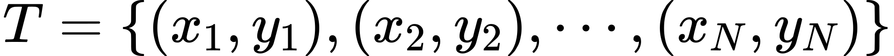

# K 近邻法

物以类聚，人以群分，K 近邻法的核心是邻居的数量和距离。

## K 近邻算法

K 近邻（K-Nearest Neighbor, KNN）学习是一种常用的监督学习方法：
- 确定训练样本，以及某种【距离度量】。
- 对于某个给定的测试样本，找到训练集中距离最近的【K 个样本】。
- 对于【分类问题】使用【投票法】获得预测结果。
- 对于【回归问题】使用【平均法】获得预测结果。
- 还可基于距离远近进行加权平均或加权投票，距离越近的样本权重最大
    - 投票法：选择这 K 个样本中出现最多的类别标记作为预测结果。
    - 平局法：将这 K 个样本的实值输出标记的平均值作为预测结果。

输入：训练数据集

$$T = \{ x = y \}$$