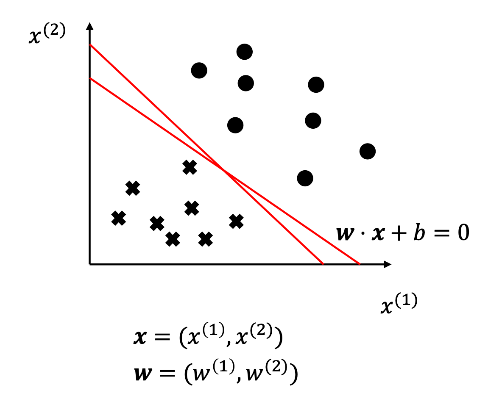

# 感知机

- 感知机是二类分类的线性分类模型
- 输入是实例的特征向量
- 输出是实例的类型 $+1, -1$
- 感知机模型是一个分离超平面
- 感知机是神经网络和支持向量机的基础

## 感知机模型的形式化定义

- 输入变量：$x \in X \subseteq R^n$（特征空间）
- 输出变量：<svg xmlns="http://www.w3.org/2000/svg" width="17.669ex" height="2.262ex" viewBox="0 -750 7809.8 1000" xmlns:xlink="http://www.w3.org/1999/xlink" aria-hidden="true" style=""><defs><path id="MJX-197-TEX-I-1D466" d="M21 287Q21 301 36 335T84 406T158 442Q199 442 224 419T250 355Q248 336 247 334Q247 331 231 288T198 191T182 105Q182 62 196 45T238 27Q261 27 281 38T312 61T339 94Q339 95 344 114T358 173T377 247Q415 397 419 404Q432 431 462 431Q475 431 483 424T494 412T496 403Q496 390 447 193T391 -23Q363 -106 294 -155T156 -205Q111 -205 77 -183T43 -117Q43 -95 50 -80T69 -58T89 -48T106 -45Q150 -45 150 -87Q150 -107 138 -122T115 -142T102 -147L99 -148Q101 -153 118 -160T152 -167H160Q177 -167 186 -165Q219 -156 247 -127T290 -65T313 -9T321 21L315 17Q309 13 296 6T270 -6Q250 -11 231 -11Q185 -11 150 11T104 82Q103 89 103 113Q103 170 138 262T173 379Q173 380 173 381Q173 390 173 393T169 400T158 404H154Q131 404 112 385T82 344T65 302T57 280Q55 278 41 278H27Q21 284 21 287Z"></path><path id="MJX-197-TEX-N-2208" d="M84 250Q84 372 166 450T360 539Q361 539 377 539T419 540T469 540H568Q583 532 583 520Q583 511 570 501L466 500Q355 499 329 494Q280 482 242 458T183 409T147 354T129 306T124 272V270H568Q583 262 583 250T568 230H124V228Q124 207 134 177T167 112T231 48T328 7Q355 1 466 0H570Q583 -10 583 -20Q583 -32 568 -40H471Q464 -40 446 -40T417 -41Q262 -41 172 45Q84 127 84 250Z"></path><path id="MJX-197-TEX-I-1D44C" d="M66 637Q54 637 49 637T39 638T32 641T30 647T33 664T42 682Q44 683 56 683Q104 680 165 680Q288 680 306 683H316Q322 677 322 674T320 656Q316 643 310 637H298Q242 637 242 624Q242 619 292 477T343 333L346 336Q350 340 358 349T379 373T411 410T454 461Q546 568 561 587T577 618Q577 634 545 637Q528 637 528 647Q528 649 530 661Q533 676 535 679T549 683Q551 683 578 682T657 680Q684 680 713 681T746 682Q763 682 763 673Q763 669 760 657T755 643Q753 637 734 637Q662 632 617 587Q608 578 477 424L348 273L322 169Q295 62 295 57Q295 46 363 46Q379 46 384 45T390 35Q390 33 388 23Q384 6 382 4T366 1Q361 1 324 1T232 2Q170 2 138 2T102 1Q84 1 84 9Q84 14 87 24Q88 27 89 30T90 35T91 39T93 42T96 44T101 45T107 45T116 46T129 46Q168 47 180 50T198 63Q201 68 227 171L252 274L129 623Q128 624 127 625T125 627T122 629T118 631T113 633T105 634T96 635T83 636T66 637Z"></path><path id="MJX-197-TEX-N-3D" d="M56 347Q56 360 70 367H707Q722 359 722 347Q722 336 708 328L390 327H72Q56 332 56 347ZM56 153Q56 168 72 173H708Q722 163 722 153Q722 140 707 133H70Q56 140 56 153Z"></path><path id="MJX-197-TEX-N-7B" d="M434 -231Q434 -244 428 -250H410Q281 -250 230 -184Q225 -177 222 -172T217 -161T213 -148T211 -133T210 -111T209 -84T209 -47T209 0Q209 21 209 53Q208 142 204 153Q203 154 203 155Q189 191 153 211T82 231Q71 231 68 234T65 250T68 266T82 269Q116 269 152 289T203 345Q208 356 208 377T209 529V579Q209 634 215 656T244 698Q270 724 324 740Q361 748 377 749Q379 749 390 749T408 750H428Q434 744 434 732Q434 719 431 716Q429 713 415 713Q362 710 332 689T296 647Q291 634 291 499V417Q291 370 288 353T271 314Q240 271 184 255L170 250L184 245Q202 239 220 230T262 196T290 137Q291 131 291 1Q291 -134 296 -147Q306 -174 339 -192T415 -213Q429 -213 431 -216Q434 -219 434 -231Z"></path><path id="MJX-197-TEX-N-2B" d="M56 237T56 250T70 270H369V420L370 570Q380 583 389 583Q402 583 409 568V270H707Q722 262 722 250T707 230H409V-68Q401 -82 391 -82H389H387Q375 -82 369 -68V230H70Q56 237 56 250Z"></path><path id="MJX-197-TEX-N-31" d="M213 578L200 573Q186 568 160 563T102 556H83V602H102Q149 604 189 617T245 641T273 663Q275 666 285 666Q294 666 302 660V361L303 61Q310 54 315 52T339 48T401 46H427V0H416Q395 3 257 3Q121 3 100 0H88V46H114Q136 46 152 46T177 47T193 50T201 52T207 57T213 61V578Z"></path><path id="MJX-197-TEX-N-2C" d="M78 35T78 60T94 103T137 121Q165 121 187 96T210 8Q210 -27 201 -60T180 -117T154 -158T130 -185T117 -194Q113 -194 104 -185T95 -172Q95 -168 106 -156T131 -126T157 -76T173 -3V9L172 8Q170 7 167 6T161 3T152 1T140 0Q113 0 96 17Z"></path><path id="MJX-197-TEX-N-2212" d="M84 237T84 250T98 270H679Q694 262 694 250T679 230H98Q84 237 84 250Z"></path><path id="MJX-197-TEX-N-7D" d="M65 731Q65 745 68 747T88 750Q171 750 216 725T279 670Q288 649 289 635T291 501Q292 362 293 357Q306 312 345 291T417 269Q428 269 431 266T434 250T431 234T417 231Q380 231 345 210T298 157Q293 143 292 121T291 -28V-79Q291 -134 285 -156T256 -198Q202 -250 89 -250Q71 -250 68 -247T65 -230Q65 -224 65 -223T66 -218T69 -214T77 -213Q91 -213 108 -210T146 -200T183 -177T207 -139Q208 -134 209 3L210 139Q223 196 280 230Q315 247 330 250Q305 257 280 270Q225 304 212 352L210 362L209 498Q208 635 207 640Q195 680 154 696T77 713Q68 713 67 716T65 731Z"></path></defs><g stroke="currentColor" fill="currentColor" stroke-width="0" transform="matrix(1 0 0 -1 0 0)"><g data-mml-node="math"><g data-mml-node="mi"><use xlink:href="#MJX-197-TEX-I-1D466"></use></g><g data-mml-node="mo" transform="translate(767.8, 0)"><use xlink:href="#MJX-197-TEX-N-2208"></use></g><g data-mml-node="mi" transform="translate(1712.6, 0)"><use xlink:href="#MJX-197-TEX-I-1D44C"></use></g><g data-mml-node="mo" transform="translate(2753.3, 0)"><use xlink:href="#MJX-197-TEX-N-3D"></use></g><g data-mml-node="mo" transform="translate(3809.1, 0)"><use xlink:href="#MJX-197-TEX-N-7B"></use></g><g data-mml-node="mo" transform="translate(4309.1, 0)"><use xlink:href="#MJX-197-TEX-N-2B"></use></g><g data-mml-node="mn" transform="translate(5087.1, 0)"><use xlink:href="#MJX-197-TEX-N-31"></use></g><g data-mml-node="mo" transform="translate(5587.1, 0)"><use xlink:href="#MJX-197-TEX-N-2C"></use></g><g data-mml-node="mo" transform="translate(6031.8, 0)"><use xlink:href="#MJX-197-TEX-N-2212"></use></g><g data-mml-node="mn" transform="translate(6809.8, 0)"><use xlink:href="#MJX-197-TEX-N-31"></use></g><g data-mml-node="mo" transform="translate(7309.8, 0)"><use xlink:href="#MJX-197-TEX-N-7D"></use></g></g></g></svg>
- 假设空间：$f(x) = sign(\mathbf{w} \cdot x + b)$

学习过程：根据训练集求解擦参数 $\mathbf{w}, b$
预测过程：判断新输入的实力的类别

## 感知机模型的求解方法（线性可分）
### 代价函数

线性可分定义：
- 给定一个数据集，若存在某个超平面 $S: \mathbf{w} \cdot x + b = 0$ 能够将数据集的正实例点和负实例点完全正确地划分到超平面两侧：
    - 对于所有的 $y_i = +1$，有 $\mathbf{w} \cdot x + b > 0$
    - 对于所有的 $y_i = -1$，有 $\mathbf{w} \cdot x + b < 0$
- 则称该数据集为线性可分数据集，反之则线性不可分

学习策略：假设数据集是线性可分的，则需找到超平面，同时为了评价模型的好坏，还需找到损失函数极小化的超平面。

### 损失函数

损失函数选择：误分类点到超平面的总距离。

几何距离：
- 点 $x_i$ 到超平面的几何距离：$\frac1{||\mathbf{w}||}| \mathbf{w} \cdot x_i+b|$
- 误分类点判定：$-y_i (\mathbf{w} \cdot x_i + b) > 0$
- 误分类点到超平面的距离总和：$-\frac1{||\mathbf{w}||}\sum_{x_i\in M}y_i(\mathbf{w}\cdot x_i+b)$

函数距离：
- 点 $x_i$ 到超平面的函数距离：$|\mathbf{w} \cdot x_i + b|$
- 误分类点到超平面的距离总和：$- \sum_{x_i \in M} y_i(\mathbf{w} \cdot x_i + b) $

### 代价函数

感知机模型 $f(x) = sign(\mathbf{w} =\cdot x + b) $ 的代价函数定义：
$$
L(\mathbf{w}, b) = - \sum_{x_i \in M} y_i (\mathbf{w} \cdot x_i + b)
$$

其中 $M$ 是误分类点的集合

